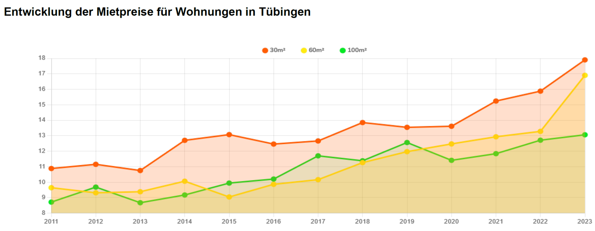

## Daten vs. Information

Im allgemeinen Sprachgebrauch werden die Begriffe "Daten" und "Information" oft synonym verwendet. In der Informatik und Datenwissenschaft haben sie jedoch unterschiedliche Bedeutungen.

Um die Trennung klar zu machen, wollen wir das folgende Bild als Ausgangspunkt nehmen:

{alt='Diagramm Mietpreise Tübingen'}

Das Diagramm [`mietpreise-tuebingen.png`](https://raw.githubusercontent.com/Dr-Eberle-Zentrum/FDM-basics/main/instructors/fig/mietpreise-tuebingen.png) zeigt die Mietpreisentwicklung in Tübingen in den Jahren 2011 bis 2023 für drei Kategorien von Wohnungsgrößen (bis 30, 60 oder 100 m²).

Ziel der Aufgabe ist es, zu überlegen, welche Daten und welche Informationen man aus diesem Diagramm ableiten kann.

### Aufgabe 1 - Wo ist der Unterschied?

Recherchieren Sie die Begriffe "Daten" und "Information" und erläutern Sie kurz den Unterschied zwischen diesen beiden Begriffen. Verwenden Sie dazu Ihre eigenen Worte und Beispiele.

Halten sie ihre Antwort in einem Textdokument `Daten-vs-Information.txt` fest.

### Aufgabe 2 - Daten und Informationen im Diagramm

Analysieren Sie das Diagramm und beantworten Sie die folgenden Fragen. Halten Sie Ihre Antworten ebenfalls in `Daten-vs-Information.txt` fest.

1. **Daten**: Welche Daten können sie aus dem Diagramm ablesen? Benennen/beschreiben sie diese Daten und die Aspekte, die sie darstellen.

2. **Information**: Welche Informationen können Sie aus dem Diagramm ableiten?
   Welche "Forschungsfragen" könnten sie stellen und mit dem Diagramm beantworten?

Fassen Sie Ihre Antworten in Stichpunktlisten im Textdokument `Daten-vs-Information.txt` zusammen.

### Abgabe

Ergänzen sie das Textdokument `Daten-vs-Information.txt` mit Ihren Autoreninformationen. Achten Sie darauf, dass das Dokument klar strukturiert und leserlich ist.

Laden Sie das Textdokument `Daten-vs-Information.txt` in das entsprechende Abgabe-Verzeichnis hoch.
