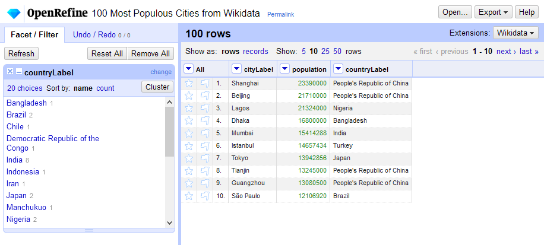

:::::::::::::::::::::::::::::::::::::: questions 

- Reproduzierbar?
- Dokumentiert?
- Skalierbar?

::::::::::::::::::::::::::::::::::::::::::::::::

::::::::::::::::::::::::::::::::::::: objectives

- Gründe für den Einsatz von Workflow-Systemen und Skriptsprachen
- Verständnis von Pipelines und deren Aufbau
- Was, wenn der eigene Rechner nicht mehr reicht?


::::::::::::::::::::::::::::::::::::::::::::::::


Datenverarbeitung ist der Kernpunkt jedes Forschungsprozesses. 
In dieser Sitzung werden wir uns mit grundlegenden Aspekten der Datenverarbeitung im Kontext des Forschungsdatenmanagements (FDM) beschäftigen. 
Hierbei liegt der Fokus auf der Bedeutung von Workflow-Systemen, Skriptsprachen und Pipelines für die effiziente und reproduzierbare Arbeitsabläufe.


Bevor wir starten, hier ein kleines fiktives Beispiel, um die Relevanz der Themen zu verdeutlichen:

::: tab

### Was bisher geschah ...

Sie verspüren heute einen unbändigen Tatendrang und möchten Daten zu Blütenformen analysieren.

Nach kurzer Recherche finden sie den [Iris-Datensatz](https://en.wikipedia.org/wiki/Iris_flower_data_set), der Informationen zu verschiedenen Iris-Arten und deren Blütenmerkmalen enthält.
Dieser Datensatz ist in einer [CSV-Datei](https://zenodo.org/record/1319069/files/iris.csv) im [Zenodo Datenrepositorium](https://zenodo.org/records/1319069) verfügbar, und sie laden ihn sofort herunter.

)](https://training.galaxyproject.org/training-material/topics/introduction/images/iris_flowers.png){width=70% alt="Three species of Iris flowers"}

Da sie lieber im TSV-Format arbeiten, konvertieren sie die Datei mit einem Texteditor mit Hilfe der "Finden und Ersetzen"-Funktion in das gewünschte Format.
Ausserdem löschen sie die Kopfzeile mit den Spaltennamen, da sie diese nicht benötigen.

Nun möchten sie die Daten analysieren.
Die erste Frage, die sich aufdrängt, ist, wieviele verschiedene Iris-Arten im Datensatz enthalten sind.
Hierfür erinnern sie sich an die "Spaltenselektion"-Funktion ihres Texteditors (Alt-Taste (Windows/Linux) bzw. Befehlstaste (Mac) gedrückt halten und dann die Maus ziehen) und extrahieren die Spalte mit den Artennamen.
Diese kopieren sie in eine neue Datei und verwenden die "Duplikate entfernen"-Funktion ihres Texteditors, um die einzigartigen Arten zu identifizieren.
Wunderbar, es sind genau drei Arten, wie erwartet.

Danach bearbeiten sie die Daten weiter mit einer Kombination aus Texteditor und Tabellenkalkulationsprogramm, um herauszufinden,

- Wieviele Datensätze gibt es pro Art?
- Wie sind die durchschnittlichen Blütenmaße pro Art?
- Wie verteilen sich die [Datenpunkte der Sepalblätter in einem Streudiagramm](https://training.galaxyproject.org/training-material/topics/introduction/images/101_foreveryone_scatter.png) coloriert nach Art?

Am Ende ihres Arbeitstages sind sie zufrieden mit den Ergebnissen, aber auch etwas erschöpft.
Sie haben sich auf einem Blatt Papier die Ergebniszahlen notiert und die Grafik ausgedruckt.

:::


:::::::::: challenge

## Und nun?

Ein paar Tage später sprechen sie mit Freunden über ihre Analyse und holen ihre Notizen und den Ausdruck.

Was könnte nun das Problem sein?

::: solution

## Mögliche Probleme

- **Nicht nachvollziehbar**: Leider sind sie sich nicht mehr sicher, welche Zahl auf ihren Notizen welche Art repräsentiert.
- **Nicht reproduzierbar**: Der Hamster hat den halben Ausdruck gefressen, aber sie wissen nicht mehr genau, wie sie die Grafik erstellt haben.
- **Fehleranfällig**: Beim Kopieren der Daten in den Texteditor haben sie versehentlich eine Zeile gelöscht, was die Ergebnisse verfälscht. Bzw. beim Notieren der Ergebniszahlen hatten sie einen Zahlendreher.
- **Zeitaufwand**: Die manuelle Bearbeitung der Daten hat viel Zeit in Anspruch genommen, die sie lieber in die Interpretation der Ergebnisse investiert hätten.
- **Fehlende Skalierbarkeit**: Sie möchten die Analyse auf einen größeren Datensatz anwenden, aber die manuelle Methode ist nicht praktikabel für größere Datenmengen.

::::::::::::

::::::::::::::::::::


## Ziele guter Datenverarbeitung

Gute Datenverarbeitung sollte folgende Ziele verfolgen:


- **Reproduzierbarkeit**: Andere (oder sie selbst zu einem späteren Zeitpunkt) sollten die Analyse mit den gleichen Daten und Methoden wiederholen können und zu den gleichen Ergebnissen kommen.
- **Nachvollziehbarkeit**: Jede Entscheidung und jeder Schritt in der Datenverarbeitung sollte dokumentiert sein, um die Analyse transparent zu machen.
- **Automatisierung**: Wiederkehrende Aufgaben sollten automatisiert werden, um menschliche Fehler zu minimieren und Zeit zu sparen.
- **Skalierbarkeit**: Die Methoden sollten auf größere Datensätze anwendbar sein, ohne dass der Aufwand exponentiell steigt.
- **Portabilität**: Die Analyse sollte auf verschiedenen Systemen und Umgebungen durchführbar sein, ohne dass umfangreiche Anpassungen erforderlich sind.

Reproduzierbarkeit und Nachvollziehbarkeit sind hierbei zwei zentrale Prinzipien in der wissenschaftlichen Forschung, die sicherstellen, dass Forschungsergebnisse verlässlich und überprüfbar sind.

Damit diese erreicht werden können, bedarf es entweder einer extrem umfangreichen Dokumentation oder - und das ist der bessere Weg - die Datenverarbeitung sollte mit Hilfe von Skriptsprachen und/oder Workflow-Systemen erfolgen.


## Skriptsprachen

Skriptsprachen sind Programmiersprachen, die speziell für die Automatisierung von Aufgaben und die Verarbeitung von Daten entwickelt wurden. 
Sie ermöglichen es Forschenden, komplexe Datenverarbeitungsaufgaben durch das Schreiben von Code zu automatisieren ohne dabei spezifische Kenntnisse über computerinterne Abläufe und Strukturen haben zu müssen.
Das heißt, Skriptsprachen abstrahieren viele technische Details und bieten eine benutzerfreundliche Syntax, die es auch Nicht-Programmierern ermöglicht, effektive Datenverarbeitungsprozesse zu erstellen.
Zudem sind Skriptsprachen oft plattformunabhängig, was bedeutet, dass Skripte auf verschiedenen Betriebssystemen ausgeführt werden können, ohne dass sie angepasst werden müssen.

Verbreitete Skriptsprachen im Forschungsdatenmanagement sind:

- **Python**: Bekannt für seine Lesbarkeit und Vielseitigkeit, mit umfangreichen Bibliotheken für Datenanalyse (z.B. Pandas, NumPy).
- **R**: Speziell für statistische Analysen und Datenvisualisierung entwickelt, mit einer großen Community und vielen Paketen (z.B. ggplot2, dplyr).
- **Bash**: Eine Unix-Shell und Skriptsprache, die häufig für Systemadministration und Automatisierung von Aufgaben in Linux-Umgebungen verwendet wird.

Auch die mit der Webentwicklung verbundene Sprache *JavaScript* kann für Datenverarbeitungsaufgaben genutzt werden.

Wenngleich Skriptsprachen viele technische Details abstrahieren, ist es dennoch wichtig, ein grundlegendes Verständnis der zugrunde liegenden Konzepte zu haben, um effektiv und effizient arbeiten zu können.

Bei der Verwendung von Skriptsprachen muss unterschieden werden zwischen 

- **Interaktive Verarbeitung**, bei der einzelne Befehle oder Code-Snippets in einer interaktiven, chatartigen Eingabe ausgeführt werden, um Daten zu analysieren und zu visualisieren.
- **Automatisierte Verarbeitung**, bei der komplette Skripte geschrieben werden, die eine Reihe von Befehlen enthalten, die nacheinander ausgeführt werden, um eine vollständige Datenverarbeitungsaufgabe zu erledigen.

Die interaktive Verarbeitung eignet sich gut für explorative Datenanalyse und schnelle Tests, hat aber die gleichen Nachteile wie die manuelle Verarbeitung.
**Die automatisierte Verarbeitung ist daher zu bevorzugen und eigenet sich für wiederholbare und skalierbare Aufgaben.**

Einer der größten Vorteile von Skriptsprachen (im Rahmen der automatisieren Verarbeitung) ist es, dass sie direkt Dokumentation und Automatisierung verbinden und i.d.R. auch Skalierbarkeit und Portabilität unterstützen.
Das heißt, ein einmal geschriebenes Skript kann immer wieder ausgeführt werden, ohne dass manuelle Schritte erforderlich sind.
Zudem erlaubt das Skript einzelne Schritte und Entscheidungen zu dokumentieren, was die Nachvollziehbarkeit erhöht.

Im Folgenden haben wir das Datenverarbeitungsbeispiel von oben in einfache Python- und R-Skripte übersetzt, welche die gleichen Schritte automatisiert durchführt:

::::::::::::: tab


### R-Skript

Hier als R-Skript:

```R
library(tidyverse)  
# (1) Daten einlesen (ersetzt Umformatierung und Kopfzeilenentfernung)
data <- read_csv('https://zenodo.org/record/1319069/files/iris.csv')
# (2) Enthaltene Arten extrahieren
distinct(data, Species)
# (3) Anzahl der Datensätze pro Art bestimmen
count(data, Species)
# (4) Gruppieren pro Art und Mittelwerte der Spalten berechnen als Pipeline
data |> 
  group_by(Species) |> 
  summarise(across(everything(), mean))
# (5) Visualisierung als Streudiagram
ggplot(data, aes(x=Sepal.Length, y=Sepal.Width, color=Species)) +
  geom_point() +
  labs(title='Sepal length as a function of sepal width', 
       x='Sepal length', y='Sepal width')
```

Der obige Code ist [online via rdrr.io ausführbar](https://rdrr.io/snippets/embed/?code=library%28tidyverse%29%20%20%0A%23%20%281%29%20Daten%20laden%20%28ersetzt%20Import%2C%20Umformatierung%20und%20Kopfzeilenentfernung%29%0Adata%20%3C-%20iris%0A%23%20%282%29%20Enthaltene%20Arten%20extrahieren%0Adistinct%28data%2C%20Species%29%0A%23%20%283%29%20Anzahl%20der%20Datens%C3%A4tze%20pro%20Art%20bestimmen%0Acount%28data%2C%20Species%29%0A%23%20%284%29%20Gruppieren%20pro%20Art%20und%20Mittelwerte%20der%20Spalten%20berechnen%20als%20Pipeline%0Adata%20%7C%3E%20%0A%20%20group_by%28Species%29%20%7C%3E%20%0A%20%20summarise%28across%28everything%28%29%2C%20mean%29%29%0A%23%20%285%29%20Visualisierung%20als%20Streudiagram%0Aggplot%28data%2C%20aes%28x%3DSepal.Length%2C%20y%3DSepal.Width%2C%20color%3DSpecies%29%29%20%2B%0A%20%20geom_point%28%29%20%2B%0A%20%20labs%28title%3D%27Sepal%20length%20as%20a%20function%20of%20sepal%20width%27%2C%20%0A%20%20%20%20%20%20%20x%3D%27Sepal%20length%27%2C%20y%3D%27Sepal%20width%27%29), um die Ergebnisse zu sehen.


### Python-Skript

Und das Gleiche als Python-Skript:

```python
import pandas as pd
import matplotlib.pyplot as plt
# (1) Daten einlesen (ersetzt Umformatierung und Kopfzeilenentfernung)
data = pd.read_csv('https://zenodo.org/record/1319069/files/iris.csv')
# (2) Enthaltene Arten extrahieren
print(data['Species'].unique())
# (3) Anzahl der Datensätze pro Art bestimmen
print(data['Species'].value_counts())
# (4) Gruppieren pro Art und Mittelwerte der Spalten berechnen
grouped_data = data.groupby('Species').mean()
print(grouped_data)
# (5) Visualisierung als Streudiagramm
plt.scatter(x=data['Sepal.Length'], y=data['Sepal.Width'], c=data['Species'].astype('category').cat.codes)
plt.title('Sepal length as a function of sepal width')
plt.xlabel('Sepal Length')
plt.ylabel('Sepal Width')
plt.show()
# PS: Legende für die Farben fehlt noch...
```

:::::::::::::::


Nicht alle Schritte der Datenverarbeitung lassen sich immer einfach in Skripte übersetzen.
Häufig sind mehrere Schritte notwendig, um eine vollständige Analyse durchzuführen, welche ggf. dann in verschiedenen Skriptdateien organisiert werden müssen.
Allerdings ist nun die übergeordnete Ausführteihenfolge der Einzelskripte entscheidend, um die gesamte Analyse durchzuführen.
Das heißt, es entsteht eine **Abhängigkeit** zwischen den einzelnen Skripten und die Organisations- und Dokumentationsprobleme verschieben sich nun auf die Ebene der **Verwaltung und Ausführung von Skript-Abfolgen**.

An dieser Stelle kommen **Workflow-Systeme** und **Pipelines** ins Spiel, die genau diese Probleme adressieren.


## Workflow-Systeme und Pipelines

*Workflow-Systeme* sind spezialisierte Softwarelösungen, die entwickelt wurden, um komplexe Datenverarbeitungsprozesse zu automatisieren, zu verwalten und zu dokumentieren.
Sie ermöglichen es Forschenden, verschiedene Schritte der Datenverarbeitung zu definieren, zu verknüpfen und auszuführen, ohne dass sie sich um die technischen Details der Ausführung kümmern müssen.
Workflows bestehen aus einer Reihe von **Schritten** oder **Tasks**, die nacheinander oder parallel ausgeführt werden können.
Jeder Schritt kann ein Skript, ein Programm oder ein Tool sein, das eine spezifische Aufgabe erfüllt.

*Pipelines* sind eine spezielle Art von Workflows, die sich auf die Verarbeitung von Daten in einer sequenziellen Abfolge von Schritten konzentrieren.
Pipelines sind besonders nützlich, wenn Daten durch mehrere Verarbeitungsschritte transformiert werden müssen, bevor sie analysiert oder visualisiert werden können.
Das Konzept der Pipeline-basierten Datenverarbeitung kommt auch in vielen Skriptsprachen vor. Hierbei erlaubt ein spezieller Pipe-Operator die Ausgabe eines Befehls direkt als Eingabe in den nächsten Befehl weiterzureichen (z.B. `|` in Bash/Shell oder `|>` in R, s.o.).


Beide Konzepte, Workflows und Pipelines, bieten mehrere Vorteile:

- **Automatisierung**: Einmal definierte Workflows können automatisch ausgeführt werden, was den manuellen Aufwand reduziert und die Effizienz erhöht.
- **Dokumentation**: Workflows dokumentieren die Abfolge der Verarbeitungsschritte, was die Nachvollziehbarkeit und Reproduzierbarkeit der Analyse verbessert.
- **Wiederverwendbarkeit**: Einmal erstellte Workflows können leicht angepasst und für ähnliche Analysen wiederverwendet werden.
- **Fehlerbehandlung**: Viele Workflow-Systeme bieten Mechanismen zur Fehlererkennung und -behandlung, was die Robustheit der Datenverarbeitung erhöht.
- **Skalierbarkeit**: Workflows können auf verschiedenen Systemen ausgeführt werden, von lokalen Rechnern bis hin zu Hochleistungsrechnern und Cloud-Umgebungen.

Hier sind einige verbreitete Workflow-Systeme und Tools zur Erstellung von Pipelines: 

- **Snakemake**: Ein Workflow-Management-System, das auf Python basiert und sich besonders für bioinformatische Analysen eignet.
- **Nextflow**: Ein weiteres beliebtes Workflow-Tool, das die Ausführung von verschiedenen Umgebungen unterstützt, einschließlich Cloud-Computing.
- **Galaxy**: Eine webbasierte Plattform, die es ermöglicht, Datenanalysen über eine grafische Benutzeroberfläche durchzuführen und Workflows zu erstellen, ohne dass Programmierkenntnisse erforderlich sind.

Es gibt aber auch einfache Workflow-Systeme für spezielle Anwendungsfälle, wie z.B. **OpenRefine** für die Datenbereinigung und -transformation.

Im Folgenden werden wir uns beispielhaft zwei dieser Tools genauer anschauen: Galaxy und OpenRefine.


### Galaxy

Die [Galaxy](https://galaxyproject.org/)-Plattform ist ein webbasiertes Workflow-System, das speziell für die Analyse von wissenschaftlichen Daten entwickelt wurde, primär im Bereich der Life-Sciences.
Galaxy bietet eine benutzerfreundliche grafische Oberfläche, die es Forschenden ermöglicht, komplexe Datenanalysen durchzuführen, ohne dass sie Programmierkenntnisse benötigen.
Die Plattform unterstützt eine Vielzahl von Datenformaten und Analysewerkzeugen, die in sogenannten "Tools" organisiert sind.

[{width=80% alt="Galaxy Benutzeroberfläche"}](https://en.wikipedia.org/wiki/Galaxy_%28computational_biology%29#/media/File:Galaxy_Workflow_Run_tuberculosis_tutorial_2025_03_v3.png)

Galaxy ermöglicht es Nutzern, Workflows zu erstellen, indem sie verschiedene Tools miteinander verknüpfen.
Diese Workflows können gespeichert, geteilt und wiederverwendet werden, was die Zusammenarbeit und Reproduzierbarkeit von Analysen fördert.
Ein weiterer Vorteil von Galaxy ist die Möglichkeit, Analysen in einer Cloud-Umgebung durchzuführen, was die Skalierbarkeit und den Zugriff auf leistungsfähige Rechenressourcen erleichtert.

Es gibt ein einführendes [Tutorial für einen Workflow in Galaxy](https://training.galaxyproject.org/training-material/topics/introduction/tutorials/galaxy-intro-101-everyone/tutorial.html), der die Schritte aus unserem Iris-Datensatz-Beispiel automatisiert.
Die darin enthaltenen Arbeitsschritte und ihre Verknüpfung zu einem Workflow können in Galaxy direkt nachvollzogen und visualisiert werden:

[{width=80% alt="Galaxy Workflow"}](https://training.galaxyproject.org/training-material/topics/introduction/images/101_foreveryone_workflow_editor.png)

[Der Workflow selbst](https://training.galaxyproject.org/training-material/topics/introduction/tutorials/galaxy-intro-101-everyone/workflows/main_workflow.html), ist dabei exportierbar und kann in anderen Galaxy-Instanzen importiert und ausgeführt werden.

Da Galaxy webbasiert ist, ist keine Installation auf dem eigenen Rechner notwendig.
Daten können direkt im Browser hochgeladen und analysiert werden.
Allerdings benötigt das System einen Server, auf dem es läuft und einiges an Rechenleistung und Administration.
Daher werden Galaxy-Instanzen häufig von Institutionen für ihre Nutzer bereitgestellt.
Es gibt aber auch öffentliche Galaxy-Server, die von jedem genutzt werden können, z.B. [usegalaxy.org](https://usegalaxy.org/).


### OpenRefine

[OpenRefine](https://openrefine.org/) (früher Google Refine) ist eine Open-Source Desktop-Anwendung zur Datenbereinigung und -transformation, die lokal auf dem eigenen Rechner installiert wird.
Sie bietet eine grafische Benutzeroberfläche, in der man große Datensätze importieren, bereinigen und untersuchen kann.

{width=80% alt="OpenRefine Benutzeroberfläche"}

OpenRefine ist besonders nützlich für die Arbeit mit unstrukturierten oder semi-strukturierten Daten, wie z.B. CSV-Dateien, Excel-Tabellen oder JSON-Daten.
Daten können hiermit einfach gefiltert, sortiert, gruppiert und transformiert werden.
Es unterstützt auch die Anwendung von regulären Ausdrücken und verwendet eine eigene Skriptsprache namens GREL (General Refine Expression Language) für komplexe Datenmanipulationen, welche Ähnlichkeiten zu JavaScript aufweist.

Alle Daten und durchgeführten Schritte werden in OpenRefine in einem sogenannten "Projekt" gemeinsam verwaltet, das exportiert und später wieder importiert werden kann.
Dies ermöglicht es, die Datenbereinigung nachvollziehbar zu dokumentieren und auf ähnliche Datensätze anzuwenden.


## Portierbarkeit

Die Portierbarkeit von Datenverarbeitungsprozessen bezieht sich auf die Fähigkeit, diese Prozesse auf verschiedenen (Betriebs)Systemen und Umgebungen (Computern) auszuführen, ohne dass umfangreiche Anpassungen erforderlich sind.
Dies ist besonders wichtig in der wissenschaftlichen Forschung, wo Datenanalysen oft auf unterschiedlichen Rechnern, in verschiedenen Institutionen oder in Cloud-Umgebungen durchgeführt werden müssen.
Oder wenn verschiedene Teammitglieder mit unterschiedlichen Systemen arbeiten.

Skriptsprachen ermöglichen häufige eine hohe Portierbarkeit, da sie plattformunabhängig sind und auf verschiedenen Betriebssystemen (Windows, macOS, Linux) ausgeführt werden können.
Hierbei muss auf dem jeweiligen System lediglich die entsprechende Laufzeitumgebung (der Interpreter) installiert sein.
Das heißt, ein einmal geschriebenes Skript kann in der Regel ohne Änderungen auf verschiedenen Systemen ausgeführt werden, solange die benötigten Abhängigkeiten (Bibliotheken, Pakete) ebenfalls verfügbar sind.

Allerdings können Unterschiede in den Systemumgebungen, wie z.B. unterschiedliche Versionen von Bibliotheken oder (Betriebs)System-spezifische Pfade, die Portierbarkeit beeinträchtigen.

Workflow-Systeme wie Galaxy sind ebenfalls darauf ausgelegt, portabel zu sein, da die erzeugten Workflows umfangreiche Metadaten über die verwendeten Tools und Arbeitsschritte enthalten, die die Ausführung auf verschiedenen Instanzen ermöglichen.
Hierbei liegt ein deutlicher Fokus darauf, das Workflows möglichst unabhängig von der zugrunde liegenden Infrastruktur sind und somit archiviert oder veröffentlicht werden können.

Ein weiterer Ansatz zur Verbesserung der Portierbarkeit ist die Verwendung von Containerisierungstechnologien wie Docker oder Singularity.
Container ermöglichen es, eine komplette Softwareumgebung, einschließlich aller Abhängigkeiten und Konfigurationen, in einem isolierten Paket zu bündeln.
Dies stellt sicher, dass die Datenverarbeitungsprozesse in der gleichen Umgebung ausgeführt werden, unabhängig vom Host-System.
Container sind besonders nützlich, wenn komplexe Software-Stacks benötigt werden, die schwer zu installieren oder zu konfigurieren sind.


## Skalierbarkeit

Skalierbarkeit bezieht sich auf die Fähigkeit eines Systems, einer Anwendung oder eines Prozesses, mit zunehmender Datenmenge oder Arbeitslast umzugehen, ohne dass die Leistung oder Effizienz erheblich beeinträchtigt wird.
Im Bezug auf Datenverarbeitung bedeutet dies, dass die Methoden und Werkzeuge, die zur Analyse von Daten verwendet werden, in der Lage sein sollten, größere Datensätze entsprechend zu verarbeiten.

Skriptsprachen bieten in der Regel eine gute Skalierbarkeit, da sie auf leistungsfähigen Computern oder Servern ausgeführt werden können, die über ausreichende Ressourcen verfügen, um große Datenmengen zu verarbeiten.
Das heißt, ein Skript, das auf einem lokalen Rechner mit einem kleinen Datensatz funktioniert, kann oft auch auf einem Hochleistungsrechner oder in einer Cloud-Umgebung ausgeführt werden, um größere Datensätze zu analysieren.
Allerdings können Skripte, die für kleine Datensätze optimiert sind, bei größeren Datenmengen ineffizient werden, wenn sie nicht entsprechend angepasst oder optimiert werden.

Workflow-Systeme wie Galaxy sind ebenfalls darauf ausgelegt, skalierbar zu sein.
Hierbei liegt der Fokus auf der Verwaltung der Ausführung von Workflows auf Hochleistungsrechnern und Cloud-Umgebungen.
Die zugrundelegenden Queue- und Ressourcenmanagement-Systeme ermöglichen es, Workflows effizient zu verteilen und auszuführen, auch wenn die Datenmengen erheblich zunehmen.
Dabei werden die einzelnen Schritte eines Workflows oft parallelisiert, um die Verarbeitungsgeschwindigkeit zu erhöhen und die Auslastung der verfügbaren Ressourcen zu optimieren.
Diese Verwaltung geschieht dabei automatisch, ohne dass der Nutzer sich um die technischen Details kümmern muss.


💬 8. Diskussion & Ausblick
  - Welche Tools nutzen die Studierenden bereits?
  - Welche Herausforderungen sehen sie in der Datenverarbeitung?
  - Ausblick auf weiterführende Themen: Datenbanken, Big Data, Machine Learning

9. Clustercomputing etc...


https://training.galaxyproject.org/training-material/topics/introduction/tutorials/galaxy-intro-101-everyone/tutorial.html
https://training.galaxyproject.org/training-material/topics/introduction/tutorials/galaxy-intro-101-everyone/workflows/main_workflow.html


# Galaxy 101 Workflow – Zusammenfassung

## 🎯 Ziel
Demonstration eines einfachen, reproduzierbaren Datenanalyse-Workflows mit Galaxy anhand des Iris-Datensatzes.

---

## 🧰 Workflow-Schritte

### 1. Datenimport
- **Tool**: `Upload Data`
- **Datei**: `iris.csv`
- **Ziel**: Laden des Iris-Datensatzes in Galaxy

### 2. CSV in tabellarisches Format umwandeln
- **Tool**: `csv_to_tabular`
- **Ziel**: Konvertierung der CSV-Datei in ein tabellarisches Format für weitere Verarbeitung

### 3. Entfernen der Kopfzeile
- **Tool**: `Remove beginning`
- **Parameter**: Entferne die erste Zeile
- **Ziel**: Entfernen der Spaltenüberschriften

### 4. Spalten extrahieren
- **Tool**: `Cut columns from a table`
- **Parameter**: Auswahl relevanter Spalten (z. B. Sepal Length, Petal Length, Species)
- **Ziel**: Reduktion auf relevante Daten

### 5. Gruppierung und Aggregation
- **Tool**: `Datamash`
- **Parameter**: Gruppieren nach Spezies, Berechnung von Mittelwerten
- **Ziel**: Statistische Analyse der Daten

### 6. Sortieren und Duplikate entfernen
- **Tool**: `Sort`, `Unique`
- **Ziel**: Aufbereitung der Daten für Visualisierung

### 7. Visualisierung
- **Tool**: `ggplot2`
- **Parameter**: Erstellen eines Scatterplots (z. B. Sepal vs. Petal Länge, farblich nach Spezies)
- **Ziel**: Grafische Darstellung der Daten

---

## 📦 Outputs
- Bereinigte und aggregierte Datentabellen
- Interaktive Visualisierungen (ggplot2-Plots)

---

## 🧠 Lernziele
- Nutzung von Galaxy als grafisches Workflow-System
- Verarbeitung tabellarischer Daten ohne Programmierung
- Erstellung und Wiederverwendung von Workflows
- Visualisierung von Daten direkt im Browser


## Zusammenfassung

:::::: keypoints

- 
  
::::::::::::::::


:::::::::: challenge

# Einordnung im Datenlebenszyklus

{width=40% alt="Datenlebenszyklus"}

::: solution

## Antwort

Das Wissen um die **digitale Repräsentation von Informationen** ist immer dann zentral, wenn Daten importiert oder exportiert werden, um sicherzustellen, dass die Daten korrekt übertragen und gespeichert werden.

- **Planung**: Festlegung von Datenformaten und -strukturen
- **Erhebung**: Korrekte Interpretation von Daten
- **Archivierung**: Export von Daten in geeigneten Formaten
- **Nachnutzung**: korrekter Datenimport und -export

:::

::::::::::::::::::::


:::::::::::::::: instructor

## Aufgaben

### Sitzungsaufgaben

- 

### Sitzungsfragen

- 

:::::::::::::::::::::::::::

