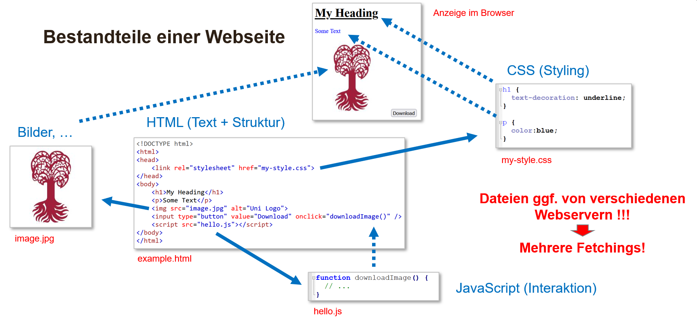

:::::::::::::::::::::::::::::::::::::: questions 

- Browser?
- Cookies?
- JavaScript?
- Suchmaschinen?

::::::::::::::::::::::::::::::::::::::::::::::::

::::::::::::::::::::::::::::::::::::: objectives

- Aufgaben und Funktionsweise von Browsern
- Einsatz und Ziele von Cookies
- Möglichkeiten und Grenzen von JavaScript
- Gedanken zu Suchmaschinen und GPTs/LLMs

::::::::::::::::::::::::::::::::::::::::::::::::

Browser sind Programme, die es ermöglichen, Webseiten oder Dokumente anzuzeigen und mit diesen zu interagieren.
Sie sind die Schnittstelle zwischen dem Nutzer und dem World Wide Web. 
Beispiele sind Google Chrome, Mozilla Firefox, Microsoft Edge und Safari (Apple).

## Historie

Die ersten Browser waren textbasiert und konnten nur einfache HTML-Dokumente (Webseiten) darstellen.
Derartige Browser sind heute noch im Einsatz, z.B. `lynx` oder `w3m`, und werden oft in der Kommandozeile verwendet.
Diese Browser sind sehr schnell und ressourcenschonend, da sie keine Grafiken oder JavaScript ausführen können, und können daher auch bei sehr langsamen Internetverbindungen eingesetzt werden.
Im Folgenden ist das Darstellen der Google-Startseite in `w3m` dargestellt:

{width=90% alt="w3m-google"}

Seit den 1990er Jahren sind Browser in der Lage, auch Grafiken und andere Medien anzuzeigen.
Die ersten Browser, die dies ermöglichten, waren Netscape Navigator und Microsoft Internet Explorer.
Die "Browserkriege" der 1990er Jahre führten zu einer Vielzahl von proprietären Technologien, die die Entwicklung von Webseiten erschwerten.
Gegen Ende der 1990er Jahre hatte Microsoft eine marktbeherrschende Stellung erreicht, die erst in den 2000er Jahren durch den Aufstieg von Mozilla Firefox und später Google Chrome gebrochen wurde.
Die Entwicklung ist in der folgenden Grarik dargestellt.

 und [statcounter.com](https://gs.statcounter.com/browser-market-share) (Dez. 2024)](fig/browser-timeline.png){width=100% alt="Browser-Marktanteile"}

Mit der Einführung von Google Chrome im Jahr 2008 begann eine neue Ära der Browserentwicklung.
Chrome war der erste Browser, der auf der JavaScript-Engine V8 basierte, die deutlich schneller war als die Konkurrenz.
Chrome führte auch eine Sandbox-Technologie ein, die es ermöglichte, Webseiten in isolierten Prozessen auszuführen, um die Sicherheit zu erhöhen.
Seitdem haben sich die Browser stark weiterentwickelt und sind heute in der Lage, komplexe Webanwendungen auszuführen, die früher nur als Desktop-Anwendungen (eigenständige Programme) möglich waren.
Mittlerweile basieren fast alle Browser auf der Open-Source-Engine Chromium (dem Herzstück von Chrome), die von Google entwickelt wurde, und sind daher sehr ähnlich in ihrer Funktionsweise.

:::::::::: challenge

# Aufgabe

Microsoft Internet Explorer war lange Zeit der dominierende Browser, da er mit Windows gebündelt war.

Welche Gründe könnten für den Aufstieg von Google Chrome verantwortlich sein?

::: solution

# Antwort

- Chrome war (wirklich) besser:
  - schneller und ressourcenschonender
  - Unterstützung für moderne Webstandards
  - ...
- ABER: Chrome ist mittlerweile der Standardbrowser auf Android-Geräten, was auch zu einer hohen Verbreitung beiträgt

:::

::::::::::::::::::::

## Aufgaben und Funktionsweise von Browsern

Browser haben verschiedene Aufgaben, darunter:

- Anzeigen von Webseiten
- Ausführen von JavaScript
- Verwalten von Cookies
- Anzeigen von Medien (Bilder, Videos, Audio)
- Ausführen von Webanwendungen (z.B. Google Docs, Facebook)
- Unterstützung von Webstandards (HTML, CSS, JavaScript)
- Sicherheit (Sandboxing, HTTPS, Passwörter, Content Security Policy)
- Barrierefreiheit (Screenreader, Tastaturnavigation)
- Datenschutz (Verschlüsselung, Do Not Track)
- Erweiterbarkeit (Plugins, Addons)
- ...

Browser sind also weit mehr als nur ein "Fenster" ins Internet, sondern eine komplexe Software, die viele verschiedene Technologien und Standards unterstützt und bündelt.
Im Folgenden werden einige dieser Aufgaben näher beleuchtet.

:::::::::::::::: testimonial

# Browser vs. Suchmaschine

Wichtig: **Browser sind keine Suchmaschinen!**

- Suchmaschinen = Webseiten, die es ermöglichen, Inhalte im Internet zu finden.
- Browser = Programme/Werkzeuge, die Webseiten anzeigen und mit ihnen interagieren.

*Das heisst, man benötigt einen Browser, um eine Suchmaschine zu benutzen, aber nicht umgekehrt.*

::::::::::::::::::::::::::::

## Webseiten anzeigen

Bevor wir uns damit beschäftigen, was alles geschehen muss, damit eine Webseite angezeigt wird, schauen wir uns an, wie eine Webseite aufgebaut ist.

Im Folgenden werden die wichtigsten **Bestandteile einer Webseite** zergliedert dargestellt.

{width=100% alt="Bestandteile einer Webseite"}

Zentral für eine Webseite ist die **HTML**-Datei, die den strukturellen Aufbau der Seite definiert.
In dieser Datei werden die verschiedenen Elemente der Seite (Überschriften, Absätze, Links, Bilder, etc.) definiert und miteinander verknüpft bzw. deren Anordnung festgelegt.

Hierbei werden in der HTML-Datei auch Verweise auf andere Ressourcen gemacht, die für die Darstellung der Seite notwendig sind.
So werden z.B. **Bilddateien** referenziert und deren Position auf der Seite festgelegt.
Auch **Schriftarten** und **CSS-Dateien** (Cascading Style Sheets) werden in der HTML-Datei referenziert, um das Aussehen der Seite zu definieren.

Interaktivität und dynamische Inhalte werden durch **JavaScript** ermöglicht, das ebenfalls in der HTML-Datei eingebettet oder referenziert wird.
JavaScript ermöglicht es, auf Benutzereingaben zu reagieren, Daten zu verarbeiten und zu speichern, und die Seite dynamisch zu verändern.

Alle diese Ressourcen müssen vom Browser zuerst geladen und verarbeitet werden, um die Seite anzuzeigen zu können.
Das Laden und Verarbeiten dieser Ressourcen wird als **Fetching** bezeichnet und kann je nach Grösse und Anzahl der Ressourcen einige Zeit in Anspruch nehmen, was sich auf die Ladezeit der Seite auswirkt und stark von der Internetverbindung abhängt.
Das anschliessende **Rendering** der Seite, also das Anzeigen der Seite im Browserfenster, kann ebenfalls einige Zeit in Anspruch nehmen, insbesondere wenn die Seite viele Elemente und komplexe Layouts enthält.
Hierbei müssen die verschiedenen Elemente der Seite anhand des HTML-Codes und der CSS-Definitionen positioniert und formatiert werden, Bilder und Schriftarten geladen und dargestellt werden, und ggf. JavaScript-Code ausgeführt werden, um finale Anpassungen vorzunehmen.
Dieser Prozess wird als **Rendering Pipeline** bezeichnet und ist ein komplexer Vorgang, der viele Schritte umfasst und von der Leistungsfähigkeit des Browsers und des Endgeräts abhängt.

## JavaScript

Heutzutage sind Webseiten oft interaktiv und dynamisch, d.h. sie reagieren auf Benutzereingaben, laden Daten nach, und passen sich an die Umgebung (z.B. den Browser oder das Endgerät) an.
Hierfür wird **JavaScript** verwendet, eine Programmiersprache, die im Browser ausgeführt wird.

Ein zentraler Fokus der Verwendung von JavaScript in Browsern ist die **Sicherheit**, da JavaScript potenziell gefährliche Aktionen ausführen kann, wie z.B. das Lesen von Dateien auf dem Computer des Benutzers oder das Senden von Daten an einen Server.
Aus diesem Grund sind Browser so konzipiert, dass sie JavaScript in einer **Sandbox** ausführen, d.h. in einer isolierten Umgebung, die den Zugriff auf bestimmte Funktionen und Ressourcen des Endgeräts einschränkt.
So kann JavaScript z.B. nicht auf das Dateisystem des Benutzers zugreifen oder auf andere Browser-Tabs oder -Fenster zugreifen.
Dies dient dazu, die Sicherheit des Benutzers und seiner Daten zu gewährleisten und die Integrität des Browsers zu schützen.

### Was geht (nicht) mit JavaScript im Browser?

| Möglich | Verhindert |
|---------|---------|
| Änderung der angezeigten Seite (HTML, CSS, Inhalte, ...) | Kein Zugriff auf andere Browser-Tabs oder -Fenster |
| Interaktion mit dem Benutzer (Klicks, Tastatureingaben, ...) | Kein (unauthorisierter) Zugriff auf Hardware (Kamera, Microfon, ...) |
| Laden von Daten vom Webseitenserver (AJAX, Fetch, ...) | Keine direkte Kommunikation mit anderen Webseiten |
| Speichern von Daten im Browser (Cookies, LocalStorage, ...) | Kein Zugriff auf das Dateisystem des Benutzers |
| Komplexe Visualisierungen und Animationen | Keine Ausführen von Programmen auf dem Endgerät |
 

:::::::::: challenge

# Aufgabe

Die Folgende Grafik von [javacript.info](https://javascript.info) fasst die verschiedenen Möglichkeiten und Einschränkungen von JavaScript im Browser zusammen.

{width=60% alt="Möglichkeiten und Einschränkungen von JavaScript im Browser"}

*Gleichen sie die Punkte aus der obigen Tabelle mit den Elementen der Grafik ab.*

::: solution

## Antwort

- **Möglichkeiten**: 
  - Serverkommunikation (grüner Smiley)
  - (stark beschränkter) Endgerätezugriff (roter Smiley nach unten)
- **Verhindert**:
  - Zugriff auf Hardware (roter Smiley nach unten)
  - Zugriff auf andere Webseiten/Server (roter Smiley nach oben rechts)
  - Zugriff auf andere Browser-Tabs/Fenster (roter Smiley nach rechts)
  - Zugriff auf Dateisystem (roter Smiley nach unten)
  - Ausführen von Programmen (roter Smiley nach unten)

:::

::::::::::::::::::::::

::::::::::: testimonial

# Weiterführende Informationen

Weiterführende Informationen zu JavaScript und seinen Möglichkeiten und Einschränkungen finden Sie auf der Webseite [javascript.info](https://javascript.info).

:::::::::::::::::::::::

## Cookies

Cookies sind kleine Textdateien, die vom Browser auf dem Endgerät des Benutzers gespeichert werden und **Informationen über die Interaktion des Benutzers mit der Webseite** enthalten.
Cookies werden verwendet, um den Benutzer zu identifizieren, seine Einstellungen und Präferenzen zu speichern, und das Verhalten des Benutzers auf der Webseite zu verfolgen.
Sie sind daher ein wichtiges Instrument *für die Personalisierung von Webseiten und die Verbesserung der Benutzererfahrung*. Mögliche Anwendungen von Cookies sind z.B.:

- **Authentifizierung**: Cookies werden verwendet, um den Benutzer zu identifizieren und seine Anmeldung auf der Webseite zu speichern.
- **Sitzungsverwaltung**: Cookies werden verwendet, um Informationen über die aktuelle Sitzung des Benutzers zu speichern, z.B. den Warenkorb in einem Online-Shop.
- **Präferenzen**: Cookies werden verwendet, um die Einstellungen und Präferenzen des Benutzers zu speichern, z.B. die Sprache oder das Design der Webseite.

Diese sogenannten **Erstanbieter-Cookies** (First-Party-Cookies) werden beim Wiederbesuch der Webseite vom Browser an den Server gesendet, um dem Server Informationen über den Benutzer und seine bisherige Interaktion mit der Webseite zur Verfügung zu stellen.
Hierbei werden dem Server nur die Informationen übermittelt, die im Webseiten-zugehörigen Cookie gespeichert sind. Ein Zugriff auf Cookies anderer Webseiten ist nicht möglich.

### ABER...

Cookies können auch von Drittanbietern (z.B. Werbenetzwerken) verwendet werden, um das Verhalten des Benutzers über verschiedene Webseiten hinweg zu verfolgen und personalisierte Werbung anzuzeigen.

- **Tracking**: Cookies werden verwendet, um das Verhalten des Benutzers auf der Webseite zu verfolgen und personalisierte Inhalte oder Werbung anzuzeigen.

Hierfür werden **Drittanbieter-Cookies** (Third-Party-Cookies) verwendet, die beim Laden von Teilen der Webseite (z.B. Werbung) von einem anderen Server als dem Webseiten-Server gesetzt werden.
Hierdurch können Drittanbieter Informationen über das Verhalten des Benutzers auf verschiedenen Webseiten sammeln und personalisierte Werbung webseitenübergreifend anzeigen.
Die Idee ist in folgender Grafik dargestellt.

{width=90% alt="Tracking mit Drittanbieter-Cookies"}

### Datenschutz und Sicherheit

Daher sind Cookies auch ein umstrittenes Thema im Hinblick auf **Datenschutz und Sicherheit**.
Einerseits ermöglichen sie die Personalisierung von Webseiten und die Verbesserung der Benutzererfahrung, andererseits können sie auch zur **Überwachung und Profilbildung** der Benutzer verwendet werden, was Datenschutzbedenken aufwirft.
Deshalb gibt es in der EU die **Cookie-Richtlinie**, die die Verwendung von Cookies regelt und den Benutzern die Kontrolle über die Verwendung von Cookies gibt.
Aufgrund dieser Richtlinie müssen Webseiten den Benutzern die Möglichkeit geben, der Verwendung von Cookies zuzustimmen oder sie abzulehnen.

### Löschen von Cookies

Benutzer können Cookies in ihrem Browser löschen, um ihre Spuren im Internet zu entfernen und ihre Privatsphäre zu schützen.
Die meisten Browser bieten die Möglichkeit, Cookies selektiv oder alle auf einmal zu löschen.
Dies kann in den Einstellungen des Browsers oder über spezielle Erweiterungen oder Add-Ons erfolgen.

:::::::: challenge

# Aufgabe

Im Folgenden sollen sie sich ein Bild machen, wieviele Cookies und welche Informationen darin gespeichert sind.

- Öffnen sie die Google Startseite in ihrem Browser [https://www.google.de/](https://www.google.de/)
- Öffnen sie die Cookie-Informationen ihres Browsers
  - Google Chrome: Tastenkombination `F12` und dann `Speicher` >> `Cookies`
  - Mozilla Firefox: Tastenkombination `UMSCHALT`+`F9`
  - Microsoft Edge: Tastenkombination `F12` und dann `Speicher` >> `Cookies`
- Öffnen sie die Cookie-Details von `www.google.de` an

*Bis wann sind die Cookies gültig?*

::: solution

# Antwort

Die Gültigkeit der Cookies ist unterschiedlich und hängt von den Einstellungen des Servers und des Browsers ab.
Zum Zeitpunkt der Erstellung dieses Dokuments (Dez 2024) haben die Cookies auf der Google-Startseite eine Gültigkeit von einem halben Jahr.

Dies zeigt, dass **Cookies eine lange Lebensdauer haben** können, da mit ihrer Hilfe i.d.R. über einen längeren Zeitraum Informationen über den Webseitennutzer gespeichert werden.

:::

::::::::::::::::::

## Best Practices für Browsernutzung

- **Aktualisieren Sie Ihren Browser regelmäßig**: Halten Sie Ihren Browser auf dem neuesten Stand, um die neuesten Sicherheitsupdates und Funktionen zu erhalten.
- **Verwenden Sie sichere Passwörter**: Verwenden Sie sichere Passwörter, um Ihr Konto und Ihre Daten zu schützen.
- **Verwenden Sie HTTPS**: Verwenden Sie HTTPS, um die Sicherheit Ihrer Verbindung zu gewährleisten und die Übertragung sensibler Daten zu schützen.
- **Verwenden Sie sichere Verbindungen**: Vermeiden Sie unsichere WLAN-Verbindungen und verwenden Sie VPNs, um Ihre Verbindung zu schützen.
- **Verwenden Sie sichere Erweiterungen**: Verwenden Sie nur vertrauenswürdige Erweiterungen und Add-Ons, um die Sicherheit Ihres Browsers zu gewährleisten.
- **Verwenden Sie sichere Einstellungen**: Überprüfen Sie die Sicherheitseinstellungen Ihres Browsers und passen Sie sie an Ihre Bedürfnisse an.
- **Verwenden Sie sichere Cookies**: Verwenden Sie nur sichere Cookies und löschen Sie regelmäßig alte Cookies, um Ihre Privatsphäre zu schützen.
- **Schließen Sie nicht benötigte Tabs**: Schließen Sie nicht benötigte Tabs und Fenster, um die Leistung Ihres Browsers zu verbessern und Speicherplatz freizugeben.
- **Löschung von Verlaufsdaten**: Löschen Sie regelmäßig Ihren Browserverlauf, um Ihre Privatsphäre zu schützen und Speicherplatz freizugeben.
- **Ausloggen aus Konten**: Melden Sie sich immer aus Ihren Konten ab, wenn Sie den Browser verlassen, um Ihre Daten zu schützen und personalisiertes Profiling zu reduzieren.

:::::::::: testimonial

# WICHTIG

**AUCH AUF DEM HANDY !!!**

:::::::::::::::::::::::

## Suchmaschinen

Aufgrund der Vielzahl von Webseiten und der Menge an Informationen, die im Internet verfügbar sind, sind Suchmaschinen ein unverzichtbares Werkzeug für die Navigation im Internet.
Hierbei werden dem Benutzer anhand von gegebenen Schlagworten oder Suchbegriffen relevante Webseiten vorgeschlagen und z.T. Informationen aus diesen direkt angezeigt.
Um dies zu ermöglichen, müssen Suchmaschinen das Internet durchsuchen und indexieren, d.h. die Inhalte von Webseiten analysieren und in einer Datenbank speichern.

Der Prozess der Suche und Indexierung wird von speziellen Programmen, sogenannten **Crawlern** oder **Spidern**, durchgeführt, die das Internet nach neuen Inhalten durchsuchen und diese in die Datenbank der Suchmaschine aufnehmen.
Hierbei werden bereits bekannte Webseiten regelmäßig auf Änderungen überprüft und neue Webseiten (z.B. aufgrund von Links von bekannten Webseiten) hinzugefügt, um sicherzustellen, dass die Datenbank aktuell und vollständig ist.
Dies geschieht in der Regel automatisch und kontinuierlich, um sicherzustellen, dass die Suchergebnisse immer auf dem neuesten Stand sind.

Für eine gegebene Suchanfrage werden dann die relevantesten Ergebnisse aus dieser Datenbank zurückgegeben.
Hierfür werden sogenannte **Ranking-Algorithmen** verwendet, die die Relevanz der Ergebnisse anhand verschiedener Kriterien bewerten und sortieren.
Dies geschieht in der Regel in Bruchteilen von Sekunden und ermöglicht es den Benutzern, schnell und effizient Informationen zu finden.

)](fig/Infografik-wie-funktioniert-eine-Suchmaschine.jpg){width=100%, alt="Grundlegender Prozess der Suchmaschinenfunktionalität"}

::::::::::::::: testimonial

# Weiterführende Informationen

Weitere Details zu Suchmaschinen und im speziellen wissenswertes zur Google Suchmaschine findet sich auf der Seite [Wie funktioniert eine Suchmaschine](https://www.xovi.de/seokompass/seo-basics/funktion-suchmaschinen/) von XOVI.

:::::::::::::::::::::::::::

### Meta-Suchmaschinen

Meta-Suchmaschinen sind Suchmaschinen, die die Ergebnisse mehrerer Suchmaschinen kombinieren und dem Benutzer eine umfassendere und vielfältigere Auswahl an Ergebnissen bieten.
Dies kann dazu beitragen, dass der Benutzer eine breitere Palette von Informationen erhält und nicht nur auf die Ergebnisse einer einzelnen Suchmaschine beschränkt ist.

## Marktanteile von Suchmaschinen

Historisch gesehen gab es vor 2000 eine Vielzahl von Suchmaschinen, die um Marktanteile konkurrierten.

) ](fig/searchengines-timeline.png){width=50% alt="Zeitverlauf von Suchmaschinen-Marktanteilen"}

Mit dem Aufstieg von Google in den 2000er Jahren hat sich der Markt jedoch stark konsolidiert, und Google hat heute einen Marktanteil von über 90% in vielen Ländern.
Dies hat dazu geführt, dass Google zu einer der dominantesten und einflussreichsten Suchmaschinen der Welt geworden ist und einen erheblichen Einfluss auf die Art und Weise hat, wie Menschen Informationen im Internet finden und welche sie konsumieren.

) ](fig/StatCounter-SearchEngines-2024.png){width=100% alt="Marktanteile von Suchmaschinen"}

### Mögliche Probleme

Grundlegend müssen Suchmaschinen mit Bedacht und Vorsicht genutzt werden, um die Qualität und Relevanz der Ergebnisse zu gewährleisten und die eigenen Daten und Privatsphäre zu schützen.
Hinter (fast) jeder Suchmaschine steht ein Unternehmen und somit ein Geschäftsmodell, das darauf abzielt, die Suche bzw. Suchergebnisse zu monetarisieren und die Benutzerdaten zu nutzen, um personalisierte Werbung zu schalten oder andere Dienste anzubieten.

Getreu dem Motto "No free lunch", sollte man immer darüber nachdenken, wie sich scheinbar kostenlose Services (wie Suchmaschinen) eigentlich finanzieren. 
Denn die **kontinuierliche Verbesserung und Bereitstellung einer Suchmaschine ist mit erheblichen Kosten verbunden** (STROM, Hardware, Personal, ...), die irgendwie gedeckt werden müssen.
Somit zahlt man bei Benutzung ggf. nicht direkt mit Geld, sondern mit seinen Daten und seiner Aufmerksamkeit bzw. wird gezielt zu Produkten/Dienstleistungen von Dritten geleitet, die mit dem Suchmaschinenbetreiber kooperieren.

Daher sind die Hauptrisiken und Probleme bei der Nutzung von Suchmaschinen:

- **Filterblase**: Suchergebnisse werden z.T. eingeschränkt und "personalisiert", dass Benutzer nur Informationen sehen, die ihren Interessen und Ansichten entsprechen, was zu einer "Filterblase" und einseitiger Informationsgewinnung führen kann.
- **Datenschutz**: Suchmaschinen können Informationen über das Suchverhalten der Benutzer sammeln und speichern, was Datenschutzbedenken aufwirft.
- **Zensur**: Suchmaschinen können Ergebnisse filtern oder zensieren, was zu einer eingeschränkten Informationsfreiheit führen kann.
- **Manipulation**: Suchmaschinen können Ergebnisse manipulieren oder beeinflussen, um bestimmte Interessen zu fördern oder zu unterdrücken.

:::::::::: testimonial

# Geht's auch ohne Google?

Mit dieser Frage beschäftigen sich die Autoren der Plattform "Digital Courage" in ihrem Artikel

- [Suchmaschinen: Alternativen zu Google](https://digitalcourage.de/digitale-selbstverteidigung/suchmaschinen).

::::::::::::::::::::::

### GPTs und LLMs als Suchmaschinen

In den letzten Jahren haben sich auch **neue Ansätze** für die Suche und das Auffinden von Informationen im Internet entwickelt, die auf **künstlicher Intelligenz** und **maschinellem Lernen** basieren.
Ein Beispiel hierfür sind **Generative Pre-trained Transformer (GPT)**-Modelle und **Large Language Models (LLM)**, die darauf abzielen, natürliche Sprache zu verstehen und zu generieren und komplexe Suchanfragen zu verarbeiten.
Beispiele hierfür sind **OpenAI's ChatGPT** oder **Google's BERT**.

Um dies zu ermöglichen, werden riesige Mengen an Textdaten verwendet, um die Modelle zu trainieren und ihnen beizubringen, natürliche Sprache zu verstehen und zu generieren.
Dies umfasst Texte aus dem Internet, Büchern, Artikeln, Foren, sozialen Medien und anderen Quellen, um ein umfassendes Verständnis der menschlichen Sprache und des Wissens zu entwickeln.

Im Gegensatz zur klassischen Suchmaschine, welche relevante Dokumente von Dritten zu einer Suchanfrage liefert, zielen GPTs und LLMs darauf ab, **direkte Antworten** auf komplexe Fragen zu liefern und **natürliche Dialoge** mit den Benutzern zu führen.
Dies kann dazu beitragen, dass Benutzer schnell und effizient Informationen finden und komplexe Fragen beantwortet bekommen, ohne auf mehrere Suchergebnisse klicken zu müssen.

Einige der **Vorteile** von GPTs und LLMs als Suchmaschinen sind:

- **Natürliche Sprachverarbeitung**: Die Fähigkeit, natürliche Sprache zu verstehen und zu generieren, ermöglicht es Benutzern, komplexe Fragen zu stellen und direkte Antworten zu erhalten.
- **Effizienz**: Durch die direkte Beantwortung von Fragen können Benutzer schnell und effizient Informationen finden, ohne auf mehrere Suchergebnisse klicken zu müssen.
- **Personalisierung**: Durch das Verständnis der Benutzeranfragen können GPTs und LLMs personalisierte Antworten und Empfehlungen liefern, die auf den individuellen Bedürfnissen und Interessen der Benutzer basieren.

#### ABER ...

Gerade die Personalisierung und die direkte Beantwortung von Fragen durch GPTs und LLMs kann auch zu **Problemen** führen:

- **Einseitige Informationsgewinnung**: Durch die direkte Beantwortung von Fragen können Benutzer nur eine begrenzte Auswahl an Informationen erhalten, was zu einer einseitigen Informationsgewinnung führen kann. Der Effekt einer **Filterblase** (wie bei Suchmaschinen) kann hierdurch noch verstärkt werden.
- **Fehlinformationen**: Da die Modelle auf riesigen Textdaten trainiert werden, können sie auch Fehlinformationen und Vorurteile enthalten und weiterverbreiten.
- **Manipulation**: Die Modelle können auch (durch Selektivität bei der Zusammenstellung der Trainingsdaten) manipuliert oder beeinflusst werden, um bestimmte Interessen zu fördern oder zu unterdrücken.
- **Datenschutz**: Die Verwendung von GPTs und LLMs erfordert z.T. (je nach Aufgabe) den Upload von Informationen und Daten, was Datenschutzbedenken aufwerfen kann.
- **Abhängigkeit von großen Unternehmen**: Die Modelle werden von großen Unternehmen wie OpenAI oder Google entwickelt und betrieben, was zu einer Abhängigkeit von diesen Unternehmen führen kann.
- **Begrenzte Aktualität**: Die Qualität und vor allem Aktualität der Antworten hängt stark von den Trainingsdaten ab, was zu Problemen führen kann, wenn die Daten veraltet sind oder nicht aktualisiert werden.

## Zusammenfassung

:::::: keypoints

- Browser sind komplexe Programme, die viele Funktionen und Dienste integrieren, um Benutzern das Surfen im Internet zu ermöglichen.
- Webseiten bestehen aus HTML, CSS und JavaScript, welche die Struktur, das Design und die Interaktivität der Seiten definieren.
- Cookies speichern webseitenspezifisch Informationen auf dem Gerät des Benutzers, um Einstellungen und Präferenzen zu speichern.
- Mit Hilfe von Cookies, JavaScript und anderen Technologien können Webseiten Benutzerdaten sammeln und verarbeiten.
- Suchmaschinen sind spezialisierte Dienste, die Benutzern helfen, Informationen im Internet zu finden, indem sie relevante Dokumente zu einer Suchanfrage liefern.
- Einseitige Informationen (durch Personalisierung), Datenschutz, Zensur und Manipulation sind Hauptrisiken und Probleme bei der Nutzung des Internets.

::::::::::::::::::::

:::::::::: challenge

# Einordnung im Datenlebenszyklus

{width=40% alt="Datenlebenszyklus"}

::: solution

## Antwort

Browser und das Suchen und Finden von Informationen im Internet sind eng mit allen Phasen des Datenlebenszyklus verknüpft.

Einen besonderen Einfluss haben sie jedoch in den Phasen **Planning und Generating**, denn bei der Planung und Generierung/Sammlung von Daten und Informationen spielen Browser und Suchmaschinen eine wichtige Rolle.
Eine unvollständige oder einseitige Datenbasis kann zu Verzerrungen und Fehlern in den späteren Phasen führen.

:::

::::::::::::::::::::

:::::::::::::::: instructor

:::::::::::::::::::::::::::
