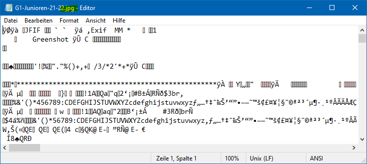

:::::::::::::::::::::::::::::::::::::: questions 

- Binär vs. Text?
- Dateiformate?
- Was für was?

::::::::::::::::::::::::::::::::::::::::::::::::

::::::::::::::::::::::::::::::::::::: objectives

- Verständnis dafür wie Daten gespeichert werden
- Wissen um gängige Dateiformate zur Datenhaltung
- Überblick welche Formate für welche Daten und Zwecke geeignet sind

::::::::::::::::::::::::::::::::::::::::::::::::

Um Daten zu speichern oder weitergeben zu können, müssen sie in einer Datei abgelegt werden.
Damit die Daten auch später wieder gelesen und verarbeitet werden können, muss dies in einer festgelegten Art und Weise geschehen, was durch das **Dateiformat** bestimmt wird.
Damit man später noch weiss, welches Dateiformat verwendet wurde, wird dieses durch eine entsprechende **Dateiendung** (engl. *file extension*) hinterlegt.
Die Dateiendung ist also lediglich ein Hinweis darauf, in welchem Format die Daten abgelegt sind, hat darüber hinaus aber keine weitere Bedeutung.

## Binär vs. Text

Dateien können entweder in **binärer** oder **Textform** abgelegt werden.
Dazu müssen wir uns erinnern, dass jedwede Information in einem Computer als Ganzzahl kodiert und diese in Binärzahlen, also einer Abfolge von **Bits** (0 und 1), repräsentiert und verwaltet werden.

Nun gibt es zwei Möglichkeiten, wie diese computerinterne Datenrepräsentation in einer Datei abgelegt werden kann.

Am kompaktesten und effizientesten ist es, die interne Binärdatendarstellung direkt als Binärdaten in einer Datei abzulegen, also als eine Abfolge von 0 und 1.
Dieses wird als sogenannte **binäre Datei** bezeichnet.
Dies hat den Vorteil, dass die Daten sehr *schnell und effizient* gelesen und geschrieben werden können, da keine Umwandlung notwendig ist.
Allerdings sind binäre Dateien *für Menschen nicht lesbar*, da sie nur aus einer Abfolge von 0 und 1 bestehen, sodass keine Interpretation oder Inspektion der Daten möglich ist.
Zudem sind binäre Dateien *nicht oder nur bedingt portabel*, da sie von der internen Datenrepräsentation des Computers und des verwendeten Anwendungsprogramms abhängen und daher nicht ohne weiteres auf anderen Systemen oder mit anderer Software gelesen werden können.

Daher werden binäre Dateiformate in der Regel nur für spezielle Anwendungen verwendet, bei denen es auf Geschwindigkeit und Effizienz ankommt, oder wenn die Daten nicht von Menschen gelesen werden müssen.
Zudem sind binäre Dateiformate in der Regel *spezialisiert* und *proprietär*[^1], d.h. sie sind nur für bestimmte Anwendungen oder Programme geeignet und können nicht ohne weiteres von anderen Programmen gelesen oder verarbeitet werden.

[^1]: Proprietär bedeutet, dass das Dateiformat von einem bestimmten Hersteller oder für dessen Programm entwickelt wurde und daher nur von diesem Programm oder von Programmen, die das Format kennen und unterstützen, gelesen oder verarbeitet werden können.

Aufgrund dessen sind binäre Dateiformate in der Regel *nicht für den allgemeinen Datenaustausch oder die Langzeitarchivierung* geeignet.

Stattdessen werden Daten, die ausgetauscht oder archiviert werden sollen, in der Regel in **Textform** abgelegt.
Hierbei werden die internen Binärdaten in eine *menschlich lesbare* Form umgewandelt, z.B. in Buchstaben, Zahlen oder Sonderzeichen, und als *Text* in einer Datei abgelegt.
Dieser muss nicht zwingend in einer menschenlesbaren Form sein, sondern kann auch in einer *maschinenlesbaren* Form abgelegt werden, z.B. als strukturierte Daten oder in einer speziellen Syntax.

Grundlegend ist aufgrund der Textform jedoch gesichert, dass die Daten in einer Form abgelegt sind, die unabhängig von der computerinternen Datenrepräsentation ist und daher *portabel* und *unabhängig* von der verwendeten Software oder dem Betriebssystem ist.

:::::::::: callout

## Ist das binär oder textbasiert?

Um zu überprüfen, ob eine Datei binär oder textbasiert ist, können Sie die Datei einfach mit einem Texteditor öffnen.
Dies ist *mit jeder Datei möglich*, unabhhängig von der Dateiendung oder dem Dateiformat!

Wenn die Datei text-basiert ist, können Sie den Inhalt lesen und bearbeiten.
Falls nicht, wird der Inhalt der Datei als unleserlicher Text oder als Zeichenfolge von Sonderzeichen angezeigt, wie in folgendem Beispiel.

{width=70%}

:::::::::::::::::::

::::::: challenge

## Sie sind dran ..

Öffnen Sie in einem Texteditor ihrer Wahl eine MS Excel Datei und eine PDF Datei.

*Was sehen Sie? Sind die Dateiformate binär oder textbasiert?*

::: solution

# Antwort

Die Excel-Datei wird als unleserlicher Text oder als Zeichenfolge von Sonderzeichen angezeigt, da sie im binären XLSX-Format gespeichert ist.
Letzteres ist eigentlich ein komprimiertes ZIP-Archiv, das verschiedene Dateien und Ordner enthält, die die Tabellenkalkulation und die Daten enthalten.

Die PDF-Datei wird je nach Inhalt als Mix aus lesbarem Text und Sonderzeichen angezeigt.
Das PDF-Format ist ein Hybridformat, in dem bestimmte Inhalte (wie Bilder) in einem binären Format gespeichert sind, während der Text z.T. in einer menschenlesbaren Form abgelegt ist.

Doch dazu später mehr...

:::::::::::::

::::::::::::::::::::::::::::::::::::::::::::::::

Im Folgenden werden wir einige der gängigsten Dateiformate für den Datenaustausch und die Langzeitarchivierung vorstellen und ihre Verwendungszwecke und Eigenschaften erläutern.

## Markdown

**Dateiendungen**: `.md`, `.markdown`

Markdown ist eine einfache Auszeichnungssprache für Textdateien. 
Das heisst, einzelne Textabschnitte können mit speziellen Zeichen oder Schlagworten versehen werden, um ihre Formattierung zu bestimmen.
Die Formatierung selbst geschieht in einem nachfolgenden Verarbeitungsschritt, bei dem der formatierte Text in einem geeigneten Format, z.B. HTML, PDF, .., abgespeichert wird.

Studieren sie folgende Webseite, in der Markdown und seine Anwendungen erklär werden:

- [Markdown Guide - Get Started](https://www.markdownguide.org/getting-started/) (Englisch)
  - oder [in Deutsch via google.translate](https://www-markdownguide-org.translate.goog/getting-started/?_x_tr_sl=en&_x_tr_tl=de&_x_tr_hl=de&_x_tr_pto=wapp) (mit einigen lustigen Übersetzungsartefakten ...)

Da die Formatierung von Markdown immer in einem separaten Schritt erfolgt, ist es sinnvoll einen Editor zu verwenden, der die Formatierung in Echtzeit anzeigt.
Im Rahmen des Kurses (und ggf. auch darüber hinaus) empfehlen wir daher den **Onlineeditor [dillinger.io](https://dillinger.io)**, welcher ohne Registrierung oder Installation genutzt werden kann.

:::::::::::: challenge

Verwenden sie den Onlineeditor [dillinger.io](https://dillinger.io) um ein einfaches Markdown-Dokument zu erstellen.

Versuchen sie darin einige der kleinen "Best Practice" Tipps, welche auf der Webseite [Markdown Guide - Basic Syntax](https://www.markdownguide.org/basic-syntax/) vorgestellt werden.

:::::::::::::::::::::::

::::::: testimonial

Markdown wird sehr häufig für Dokumentationen, Readme-Dateien und auch für einfache Webseiten verwendet. (Auch diese Webseite wurde basierend auf Markdown erzeugt!)

In diesem Kurs werden wir daher ab sofort Markdown für (fast) alle Dokumentationen verwenden, um dies zu üben.

Sie können daher [dillinger.io](https://dillinger.io) schon direkt zu ihren Lesezeichen im Browser hinzufügen.

:::::::::::::::::::::::

## Programmierskripte

Neben reiner Textinformation werden auch *Programmierskripte* in Textdateien abgelegt.
Diese enthalten Anweisungen und Befehle, die von einem Computer ausgeführt werden können, um bestimmte Aufgaben zu erledigen.
Die Skripte werden in einer *Programmiersprache* geschrieben, die speziell für die Erstellung von Programmen und Skripten entwickelt wurde.
Zur Dokumentation und Weitergabe von (Forschungs)Daten ist es daher häufig wichtig, auch die verwendeten Programmierskripte zu speichern und zu teilen.
Daher sollten sie gängige Programmiersprachen und -skripte kennen, um derartige Dateien identifizieren zu können.

Einige wichtige **Dateiendungen** für Programmierskripte sind:

- `.py` - Python
- `.R` - R
- `.js` - Javascript
- `.sh` - Shell - Linux/MacOS Kommandozeile
- `.bat` - Batchskripte - MS DOS/Windows Kommandozeile
- `.ps1` - Powershellskripte - erweiterte MS Windows Kommandozeile

Markdown wird auch sehr häufig in Verbindung mit Programmiersprachen verwendet, um Codebeispiele und Dokumentationen zu erstellen.
Zudem wurden "Hybridformate" entwickelt, die sowohl Markdown für Beschreibungen als auch direkt auszuführende Programmieranweisungen enthalten.
Beispiele hierfür sind:

- Jupyter Notebooks (`.ipynb`), 
- R Markdown (`.Rmd`) oder R Notebooks (`.Rnb`).

Diese Formate ermöglichen es, Code und Dokumentation bzw. Interpretation in einem Dokument zu kombinieren und interaktiv auszuführen, was sie besonders für die Datenanalyse und -visualisierung geeignet macht.
Zudem können sie in verschiedene Formate exportiert werden, z.B. als HTML, PDF oder Präsentation, was sie *für die Veröffentlichung und den Austausch von Ergebnissen* nützlich macht.
Auch hier gilt, dass ggf. nicht nur das erzeugte finale Dokument, sondern auch das ursprüngliche Notebook gespeichert und geteilt werden sollte, um die Nachvollziehbarkeit und Reproduzierbarkeit der Analyse zu gewährleisten.

## Tabellen

**Dateiendungen**: 
- textbasierte Formate, z.B.
  - `.csv` - Comma Separated Values
  - `.tsv` - Tab Separated Values
- binäre Formate, z.B.
  - `.xls`, `.xlsx` - MS Excel
  - `.ods` - Open Document Spreadsheet

## Hierarchische Daten

**Dateiendungen**:
- `.json` - JavaScript Object Notation
- `.xml` - Extensible Markup Language
- `.yaml` - YAML Ain't Markup Language

::::::::::: keypoints

- Markdown - Dokumentation und einfach formatierte Texte

::::::::::::::::::::

:::::::::: challenge

# Einordnung im Datenlebenszyklus

{width=40%}

::: solution

## Antwort

Die richtige Wahl des Dateiformats ist in allen Phasen des Datenlebenszyklus wichtig:

- **Planung**: Auswahl geeigneter Formate für die Datenerhebung, -analyse und -publikation
- **Erhebung**: Speicherung und Dokumentation der Daten
- **Analyse**: Verwendung von geeigneten Formaten für die Analyse (Skripte) und von Zwischenergebnissen (ggf. proprietäre Formate)
- **Publikation**: Bereitstellung der Daten in geeigneten Formaten
- **Archivierung**: Langzeitarchivierung in geeigneten Standardformaten
- **Nachnutzung**: Dokumentation; Auswahl von Formaten, die die eigene Nachnutzung erleichtern

:::

::::::::::::::::::::

::::: instructor

TODO link zu Aufgabe

::::::::::::::

