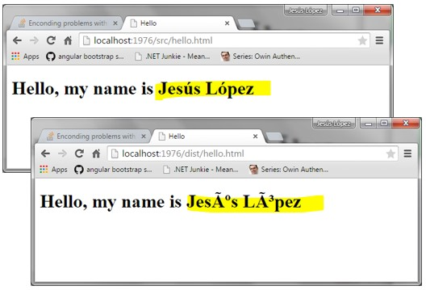
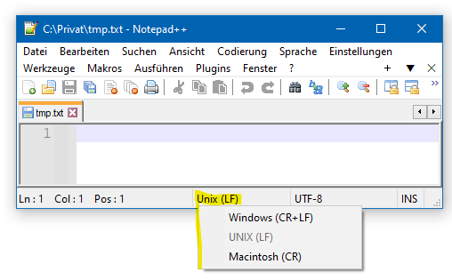
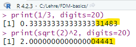

:::::::::::::::::::::::::::::::::::::: questions 

- Wie wird ... gespeichert?
- Was gibt es für Probleme?
- Worauf muss man achten?

::::::::::::::::::::::::::::::::::::::::::::::::

::::::::::::::::::::::::::::::::::::: objectives

- Verständnis wie verschiedene Informationstypen digital repräsentiert sind
- Wissen um die Grenzen und Schwierigkeiten von Informationsspeicherung
- Lösungsstrategien für häufige Daten(import)probleme

::::::::::::::::::::::::::::::::::::::::::::::::

Grundlegende Formen von Information sind Texte, Zahlen, Zeiten, Farben (für Bild und Video) und Audio. 
Wenn wir an diese denken, haben wir meistens eine Vorstellung von einem physischen Medium wie einem Blatt Papier etc., auf dem diese gespeichert sind.
Eine solche Form der Informationsspeicherung wird als **analoge** Speicherung bezeichnet.

In Computern wird Information in Form von **digitalen Daten** gespeichert.
Digital bedeuted, vereinfacht gesagt, dass die Information in Form von Zahlen gespeichert wird, die wiederum in Form von elektrischen Signalen (z.B. "Strom an oder aus") repräsentiert werden.
Letzteres ist die Grundlage für die Funktionsweise von Computern.

Das bedeutet, dass alle Informationen, die wir in Computern speichern, in Form von Zahlen repräsentiert werden muss.
Eine weitere wichtige Eigenschaft von digitalen Daten ist, dass sie in **diskreten** Einheiten gespeichert werden, also i.d.R. in Form von ganzen Zahlen.

Im Folgenden werden wir uns mit den verschiedenen Arten von Information und deren digitaler Repräsentation beschäftigen.

## Text

Text ist die einfachste Form von digitalen Daten.
Text wird in Computern in Form von **Zeichenketten** gespeichert, das heißt einer Abfolge von Zeichen.
Jedes Zeichen wird dabei durch eine Zahl repräsentiert, wobei die Zuordnung von Zeichen zu Zahlen durch eine **Zeichenkodierung** festgelegt wird.
Letztere ist eine Tabelle, die jedem Zeichen eine Zahl zuordnet.

Die bekannteste und eine der ersten ist die **ASCII**-Kodierung (American Standard Code for Information Interchange), welche 128 Zeichen umfasst und im Folgenden dargestellt ist.

![ASCII-Kodiertabelle. Nichtsichtbare Steuerzeichen sind in eckigen Klammern angegeben.[^1]](https://upload.wikimedia.org/wikipedia/commons/thumb/1/1b/ASCII-Table-wide.svg/800px-ASCII-Table-wide.svg.png){alt='ASCII'}

[^1]: Quelle: [Wikimedia Commons](https://simple.m.wikipedia.org/wiki/File:ASCII-Table-wide.svg) - 07.08.2024

Wenn wir die Tabelle betrachten, fällt uns auf, dass nicht nur Buchstaben oder Ziffern, sondern auch Sonderzeichen und Steuerzeichen (z.B. Zeilenumbruch) enthalten sind.
Zudem fehlen Umlaute und Sonderzeichen, die in anderen Sprachen verwendet werden.

Daher wurden im Laufe der Zeit weitere Zeichenkodierungen entwickelt, die mehr Zeichen umfassen.
Hier ein paar Beispiele:

- **latin1** (ISO-8859-1): 256 Zeichen, enthält Umlaute und Sonderzeichen für westeuropäische Sprachen
- **latin2** (ISO-8859-2): 256 Zeichen, enthält Umlaute und Sonderzeichen für osteuropäische Sprachen
- **GB2312**: 6.763 Zeichen, enthält chinesische Schriftzeichen
- **UTF-8**: 1.112.064 Zeichen, enthält fast alle Schriftzeichen der Welt

Hierbei ist zu beachten, dass die erweiterten Zeichenkodierungen rückwärtskompatibel sind, d.h. die Zahlen-Buchstaben-Kodierungen der ersten 128 Zahlen entsprechen i.d.R. der "alten" ASCII-Kodierungen.

Aktuell ist **UTF-8** die am weitesten verbreitete Zeichenkodierung, da sie fast alle Schriftzeichen der Welt umfasst und daher für die meisten Anwendungsfälle geeignet ist.
Diese Kodierung wird auch von den meisten neueren Betriebssystemen und Anwendungen standardmäßig verwendet.

:::::::::::::::  challenge

# Kodierungsprobleme

*Was kann passieren, wenn ein Text mit **latin1**-Kodierung abgespeichert wird (also in Zahlen umgewandelt wird) und anschliessend mit **latin2**-Kodierung gelesen wird (also die Zahlen wieder mit Buchstaben ersetzt werden)?*

:::::::::: solution

# Antwort

Es werden falsche Zeichen angezeigt, da die Zahlen-Buchstaben-Zuordnung nicht übereinstimmt.

:::::::::::::::::::

:::::::::::::::::::::::::::

Das Problem mit den verschiedenen Zeichencodierungen ist, dass beim Öffnen einer Datei mit einer anderen Codierung als der, in der sie gespeichert wurde, die Zeichen falsch dargestellt werden.
Daher ist es wichtig, die Codierung einer Datei zu kennen, um sie korrekt lesen zu können.
Ein deutliches Zeichen, dass die falsche Codierung verwendet wird, ist, wenn anstelle von Umlauten oder Sonderzeichen nur Fragezeichen oder andere Zeichen angezeigt werden, wie in folgendem Bild.

{alt='Kodierungsproblem'}

Dies tritt häufig auf, wenn man mit *älteren Dateien* arbeitet, was gerade im wissenschaftlichen Bereich *in der Datennachnutzung von Daten* immer wieder vorkommt.


::::::::::: testimonial

# Hinweis

In diesem Fall, muss man händisch die Codierung ändern, um den Text korrekt darzustellen.
Hier bleibt häufig nichts weiter übrig, als die Codierung auszuprobieren, bis der Text korrekt dargestellt wird.
Dabei ist es hilfreich, über den Ursprung der Datei Bescheid zu wissen.

Hier kommt wieder die Dokumentation von Daten ins Spiel!

:::::::::::::::::::::::::

### Zeilenumbruch im Text

Ein weiteres Problem, das beim Lesen und Verarbeiten von Textdateien auftreten kann, ist der **Zeilenumbruch**, also das Zeichen, das angibt, dass eine neue Zeile beginnt.
In aktuellen Betriebssystemen wird der Zeilenumbruch unterschiedlich abgespeichert:

- **Windows**: `\r\n` (zwei Zeichen: Carriage Return und Line Feed)
- **Linux**: `\n` (ein Zeichen: Line Feed)
- **MacOS**: `\r` oder `\n`, je nach Alter des Betriebssystems (Carriage Return oder Line Feed)

Dies kann dazu führen, dass Textdateien auf einem Betriebssystem, auf dem sie nicht erstellt wurden, nicht korrekt dargestellt oder verarbeitet werden können.

::::::::::: testimonial

# Hinweis

Texteditoren wie Notepad++ oder Visual Studio Code können automatisch die Zeilenumbrüche in Textdateien erkennen und korrekt darstellen.
Auch ist es dort möglich, die Zeilenumbrüche in einem Textdokument zu konvertieren, d.h. von einem Format in ein anderes zu ändern.

{alt='Notepad++'}

::::::::::::::::::::::::

## Zahlen

Bei der Darstellung von Zahlen werden zwei Formen unterschieden:  **Ganzzahlen** und **Fließkommazahlen**.


### Ganzzahlen

Ganzzahlen, also 1, 13, 42, oder 987654321, werden in Computern durch ihre Zerlegung in 2er-Potenzen gespeichert. Zum Beispiel zerlegt sich 13 in 8+4+1, also 2^3 + 2^2 + 2^0.
Im Computer selbst, können nur binäre Zustände, wie Strom an oder aus etc., gespeichert werden. 
Daher wird kodiert, ob eine 2er-Potenz in der Zahl enthalten ist oder nicht.
Hieraus ergibt sich eine **Binärdarstellung** der Zahl.
Im Beispiel der 13 also 1101, wobei die 1en die enthaltenen 2er-Potenzen repräsentieren und die Zahl wird (wie bei Dezimalzahlen auch) von rechts nach links gelesen, wobei die rechte Stelle 2^0 repräsentiert.
Somit entspricht die Binärdarstellung 1101 der Dezimalzahl 13, da 2^3 + 2^2 + 2^0 = 8 + 4 + 1 = 13.
Dies erlaubt die Speicherung beliebiger Ganzzahlen, solange genügend 2er-Potenzen zur Verfügung stehen, welche durch die maximale Länge der Binärdarstellung begrenzt ist.

::::::::::::::::: callout

## Text => Ganzzahl => Binär

Da jedem Buchstaben über die Zeichenkodierung eine Zahl zugewiesen wird, und Ganzzahlen in Binärzahlen umgewandelt werden können, kann auch ein Text in Binärzahlen umgewandelt und gespeichert werden.

:::::::::::::::::::::::::

### Binärzahlen

Normalerweise werden Zahlen in Dezimaldarstellung verwendet, also mit den Ziffern 0-9.
Zahlen werden von rechts nach links gelesen, wobei jede Stelle eine 10er-Potenz repräsentiert und die Ziffer der jeweiligen Stelle der Faktor der entsprechenden 10er-Potenz ist. Hier ein Beispiel zur Illustration:

```plaintext
312 = 300 + 10 + 2= 3*100 + 1*10 + 2*1 = 3*10^2 + 1*10^1 + 2*10^0 = 312
```

Binärzahlen hingegen verwenden nur die Ziffern 0 und 1, folgen ansonsten aber den gleichen Regeln wie Dezimalzahlen.
Sie werden also auch von recht nach links gelesen, wobei jede Stelle eine 2er-Potenz repräsentiert und die Ziffer der jeweiligen Stelle der Faktor der entsprechenden 2er-Potenz ist. 
Hier ein Beispiel zur Illustration:

```plaintext
1101 = 1*2^3 + 1*2^2 + 0*2^1 + 1*2^0 = 8 + 4 + 0 + 1 = 13
```

Wie auch bei Dezimalzahlen werden führende 0en meistens weggelassen, da sie keinen Einfluss auf den Wert der Zahl haben.
Zudem können auch Binärzahlen addiert, subtrahiert, multipliziert und dividiert werden.

Die Binärdarstellung von Zahlen ist in der Informatik von großer Bedeutung, da sie die *Grundlage für die digitale Speicherung und Verarbeitung von Zahlen* in Computern bildet.

::::::::::::: challenge

### Frage

Welche Dezimalzahl repräsentiert die Binärzahl 1010?

:::::: solution

## Hinweis

Die 2er-Potenzen sind 

- 2^0 = 1
- 2^1 = 2
- 2^2 = 4
- 2^3 = 8

:::::::::::::::

:::::: solution

### Antwort

Die Binärzahl 1011 entspricht der Dezimalzahl 10, da 

```plaintext
1*2^3 + 0*2^2 + 1*2^1 + 0*2^0 = 8 + 0 + 2 + 0 = 10.
```

::::::::::::::::

:::::::::::::::::::::::::


::::::::::: testimonial

## Bits und Bytes

Einzelne "01 Ziffern" einer Binärzahl werden **bit** genannt, was für "binary digit" steht.

Kolonnen von 8 Bits werden **Byte** genannt, was für "by eight" steht.

Ein Byte kann also 256 verschiedene Werte annehmen, da 2^8 = 256 verschiedene 01 Kombinationen mit 8 Stellen möglich sind.

:::::::::::::::::::::::

Um Daten im Computer speichern, verwalten und abrufen zu können, ist es unumgänglich schon im Vorfeld zu wissen, wie viele Bits und Bytes für die jeweilige Information verwendt wurde.
Andernfalls könnten zu wenige oder zuviele Bits gelesen werden, was zu einem falschen Ergebnis führen würde.
Oder noch schlimmer: Datenoperationen überlappen, das heisst das Speichern einer Information überschreibt (ggf. auch nur teilweise) eine andere Information.

Um dies zu vermeiden und die Datenintegrität zu gewährleisten, wurden Standards festgelegt, welche die Anzahl der Bits und Bytes für verschiedene Datentypen festlegen. Hier ein paar Beispiele:

- **int** (Integer): 4 Bytes (32 Bit)
- **long** (Long Integer): 8 Bytes (64 Bit)
- **char** (Character): 1 Byte (8 Bit)
- **float**: 4 Bytes (32 Bit) - für Gleitkommazahlen
- **double**: 8 Bytes (64 Bit) - für Gleitkommazahlen

Um **negative Zahlen** darstellen zu können, wird in der Regel das erste Bit als Vorzeichenbit verwendet.
Dieses schränkt die Anzahl der darstellbaren Zahlen ein, da nur noch 7 Bit (bzw. 1 Bit weniger) für die eigentliche Zahlenrepräsentation zur Verfügung stehen.


::::::::: callout

## Überlaufproblem

Da die Anzahl der Bits, die zur Speicherung einer Zahl zur Verfügung stehen, begrenzt ist, kann es zu einem Überlauf kommen.
Ein Überlauf tritt auf, wenn das Ergebnis einer Berechnung mehr Stellen benötigt als die maximale Anzahl an Bits, die zur Speicherung zur Verfügung stehen.
Hierbei werden die führenden Stellen einfach abgeschnitten, was zu einem falschen Ergebnis führt.

```plaintext
Beispiel unter der Annahme von 3 Bit Zahlendarstellung:

 7 + 3 = 111 + 011 = (1)010 (Dezimalzahl 10, aber 4 Bit nötig und nur 3 vorhanden > Überlauf)
                   = 010 (auf letzte 3 Bit reduzierte Speicherdarstellung)
                   = 2 (entsprechende Dezimalzahl, falsches Ergebnis)
```

Diese Problem ist heutzutage jedoch durch die Verwendung von 32 oder 64 Bit Zahlen in modernen Computern nur noch selten relevant.

:::::::::::::::::


### Fließ- oder Gleitkommazahlen

Kommazahlen wie 0,0012 können auf verschiedene Arten geschrieben werden, z.B.

- als Bruch 12/10000
- als Dezimalzahl 0,0012
- als wissenschaftliche Notation *1.2e-3* oder *1.2E-2*

Die wissenschaftliche Notation kann auf zwei Arten interpretiert werden.
Zum einen als mathematische Formel "1,2 * 10^-3 = 1,2 * 0,001 = 0,0012".
Alternativ kann auch herauslesen, dass das Komma in der Zahl 1.2 um 3 Stellen nach links verschoben werden muss, um die eigentliche Zahl 0,0012 zu erhalten.

Letztere Interpretation ist die, die in Computern verwendet und als **Gleit- oder Fließkommazahl** bezeichnet wird.
Hierbei wird die Zahl in zwei Teile zerlegt: die **Mantisse** und den **Exponenten**.
Die Mantisse enthält die eigentliche Zahl, also 1.5, 3.14159, oder 42.0, und der Exponent gibt (vereinfacht gesagt) an, um wie viele Stellen das Komma nach links oder rechts verschoben werden muss, um die eigentliche Zahl zu erhalten.
Der Trick ist nun, dass *sowohl Mantisse als auch Exponent als Ganzzahlen* gespeichert werden können, für die wir schon eine Umrechnung in Binärzahlen kennen.

Dies funktioniert sehr gut für Zahlen, die sich als Potenzen von 10 darstellen lassen, wie 0,0012 = 1.2 * 10^-3.
Für Zahlen, die sich nicht als Potenzen von 10 darstellen lassen, wie 1/3 = 0.3333333333333333..., kann es zu **Rundungsfehlern** kommen, da der Computer nur eine begrenzte Anzahl von Stellen für die Mantisse und den Exponenten speichern kann, da  beide als Ganzzahl gespeichert werden.
Dieses Problem ist in folgender Grafik verdeutlicht, indem verschiedene sehr kurze Mantissenlängen dargestellt sind.

![Genauigkeit von Gleitkommazahlen hängt sehr stark von der Mantissenlänge (Anzahl Bits) ab und sinkt mit steigendem Abstand zu 0.[^2] ](https://upload.wikimedia.org/wikipedia/commons/8/8f/Exakt_darstellbare_Gleitkommazahlen.png){width=50%}

[^2]: Quelle: [Roland Illig - Wikimedia Commons](https://commons.wikimedia.org/wiki/File:Exakt_darstellbare_Gleitkommazahlen.png) - 07.08.2024

::::::::::::::::: callout

## Rundungsfehler beim Rechnen mit Fließkommazahlen

Da der Computer nur eine begrenzte Anzahl von Stellen für die Mantisse und den Exponenten speichern kann, kann es zu Rundungsfehlern kommen, wenn mit Fließkommazahlen gerechnet wird.
Hier ein Beispiel unter Verwendung der Programmiersprache R.

{alt='Rundungsfehler in R'}

:::::::::::::::::::::::::


:::::::::::::: challenge

### Frage

Überlegen sie, wo derartige Rundungsprobleme zu Problemen führen könnten, sodass in diesen Bereichen mit anderen Datentypen gearbeitet werden sollte.

:::::::: solution

## Antwort

Ein Beispiel für ein Problem, bei dem Rundungsfehler zu Problemen führen können, ist die Berechnung von Zinsen.

Auch z.B. zur Berechnung von Marsmissionen oder anderen wissenschaftlichen Berechnungen, bei denen sehr genaue Ergebnisse erforderlich sind, werden andere Datentypen bzw. mathematische Tricks verwendet.

::::::::::::::

::::::::::::::::::::::::::


### Sprachabhängige Zahlendarstellung

Ein häufiges Problem bei der Verarbeitung von Zahlen ist die **sprachabhängige Darstellung** von Zahlen.
In Deutschland (und vielen Ländern Westeuropas) wird die Zahl 1000 als *1.000,00* geschrieben, während in den USA die gleiche Zahl als *1,000.00* geschrieben wird.

Das heisst *das verwendete Trennzeichen für die "Nachkommastellen" und die Tausenderstellen ist unterschiedlich bzw. umgekehrt*.

Solange Zahlen direkt in Binärform gespeichert und eingelesen werden, ist dies kein Problem, da nur die Darstellung der Zahl, nicht aber die Zahl selbst, von der eingestellten Benutzersprache abhängt.

Sobald jedoch Zahlen in Textform eingelesen oder ausgegeben werden, kann es zu Problemen kommen, wenn die Zahlen in einem anderen Format gespeichert sind, als das, in dem sie eingelesen werden sollen.

Wenn sie z.B. eine Datei mit der amerikanischen Notation *1,000* mit einer "deutschen" Software einlesen, wird die Zahl als 1 gelesen, da die deutsche Software das Komma als Dezimaltrennzeichen interpretiert.

::::::::::: testimonial

# Hinweis

Wenn sie fremde textbasierte Daten einlesen, sollten sie diese immer auf das verwendete Zahlenformat überprüfen, um sicherzustellen, dass die Zahlen korrekt eingelesen werden.

Alle Textdatenimportfunktionen in Programmiersprachen (wie Python oder R) und Datenverarbeitungssystemen (wie MS Excel)  bieten die Möglichkeit, das zu importierende Zahlenformat anzugeben, um solche Probleme zu vermeiden.

Aber *sie selbst* müssen *daran denken*!

::::::::::::::::::::::::


## Zeit

Die Zeit wird in Computern als **Anzahl von (Milli)Sekunden seit einem festgelegten Zeitpunkt** gespeichert.

Dieser Zeitpunkt ist in der Regel der 1. Januar 1970 um 00:00:00 Uhr (UTC), auch als **Unix-Zeit** bekannt.
Diese Darstellung hat den Vorteil, dass die Zeit als Ganzzahl gespeichert werden kann, was die Speicherung und Verarbeitung vereinfacht und Rundungsfehler vermeidet.

::::::::: challenge

## Jahr-2038-Problem

Ein Problem bei der Speicherung von Zeit als Ganzzahl ist das **Jahr-2038-Problem**.
Lesen sie diesen [Wikipedia-Artikel](https://de.wikipedia.org/wiki/Jahr-2038-Problem) und erklären sie, warum es auftritt und welche Auswirkungen es haben könnte.

:::: solution

## Antwort

Das Jahr-2038-Problem tritt auf, weil die Unix-Zeit als *vorzeichenbehaftete* 32-Bit-Ganzzahl gespeichert wird.

Das heisst nicht alle 32 Bit sind für die Zahl selbst reserviert, sondern das erste Bit gibt das Vorzeichen an.
Da die Unix-Zeit den 1. Januar 1970 als Nullpunkt hat, wird die Zeit in Sekunden seit diesem Zeitpunkt gespeichert.
Da eine 32-Bit-Ganzzahl nur 2^32 = 4.294.967.296 verschiedene Werte speichern kann, wird die Unix-Zeit am 19. Januar 2038 um 03:14:07 Uhr UTC den Wert 2.147.483.647 erreichen.
Da die Unix-Zeit als vorzeichenbehaftete Ganzzahl gespeichert wird, wird der Wert am 19. Januar 2038 um 03:14:07 Uhr UTC auf -2.147.483.648 springen, was zu einem **Überlauf** führt.
Dieser Überlauf führt dazu, dass die Zeit wieder bei -2.147.483.648 beginnt, was dem 13. Dezember 1901 um 20:45:52 Uhr UTC entspricht.

::::::::::::::

::::::::::::::::::::

## Farben

Farben werden in Computern z.B. als **RGB-Werte** gespeichert, also als Kombination von Rot-, Grün- und Blauanteilen des jeweiligen Lichtes.
Jeder dieser Anteile wird als Zahl zwischen 0 und 255 gespeichert, wobei 0 für keinen und 255 für den maximalen Anteil des jeweiligen Farbtons steht.
Das es sich um "Lichtfarben" handelt, wird somit die Farbe Weiß als (255, 255, 255) und die Farbe Schwarz als (0, 0, 0) gespeichert.

Da es sich um Ganzzahlen handelt, können diese auch in Binärform gespeichert werden, wobei die 8 Bit für jeden Farbton die Binärdarstellung der Zahl zwischen 0 und 255 darstellen. 
Aufgrund der diskreten Werte für die Farbanteile sind **Farbverläufe** nicht stufenlos sondern nur in diskreten Schritten möglich.

Neben RGB gibt es auch andere Farbmodelle, wie z.B. **CMYK** (Cyan, Magenta, Yellow, Key) für den Druck oder **HSV** (Hue, Saturation, Value) für die Farbdefinition.
Auch hier werden die Farben als Zahlen gespeichert, wobei die Umrechnung zwischen den verschiedenen Farbmodellen durch mathematische Formeln erfolgt.

Farbkodierung liefert die Grundlage für Bild- und Videodaten, die selbst wieder in verschiedensten Formaten gespeichert werden können.

:::::::: challenge

### Frage

Wenn sie im Farbkasten Rot, Grün und Blau mischen, entsteht i.d.R. nicht weiß, sondern ein Braunton. Warum ist das so?

:::::::: solution

### Antwort

Die Farben im Farbkasten sind Pigmente, die das Licht absorbieren und nur bestimmte Farben reflektieren.
Wenn sie Rot, Grün und Blau mischen, absorbieren sie fast alles Licht, sodass die Mischung dunkel erscheint.

::::::::::::

::::::::::::::::::


## Audio

Auch **Audiodaten** werden als Zahlen gespeichert, wobei die Amplitude des Schallsignals als Zahl gespeichert wird.
Die Amplitude wird in der Regel als Zahl zwischen -1 und 1 gespeichert, wobei -1 für den minimalen und 1 für den maximalen Schalldruck steht.
Da es sich um eine kontinuierliche Größe handelt, wird die Amplitude in der Regel als Gleitkommazahl gespeichert, um eine möglichst genaue Repräsentation des Schallsignals zu erhalten.


## Zusammenfassung

:::::: keypoints

- Jedwede Information wird i.d.R. durch Ganzzahlen repräsentiert
  - Text via Zeichenencodingstabellen
  - Gleitkommazahlen z.B. durch Mantisse und Exponent
  - Zeit z.B. als Anzahl von Sekunden seit einem festgelegten Zeitpunkt
  - Farben z.B. durch RGB-Werte
- Ganzzahlen können in Binärform gespeichert und verarbeitet werden
  - dabei in 2er-Potenzen zerlegt
  - Interpretation analog zu Dezimalzahlen (rechts nach links, ...)
  - Bit = eine "Ziffer" einer Binärzahl (0 oder 1)
  - 8 Bit = 1 Byte
  - Anzahl der Bits bestimmt die maximal darstellbare Zahl (Überlaufproblem)
- Probleme digitaler Informationsrepräsentation
  - Überlaufproblem bei zu großen Zahlen
  - Diskretisierung von kontinuierlichen Größen
    - Rundungsfehler bei Gleitkommazahlen
    - Verlust von Genauigkeit bei zu kleinen/großen Zahlen
  - Kodierungsprobleme bei Textimport
    - Sprachabhängige Darstellung von Zahlen
    - Unterschiedliche Zeichenencodings
  
::::::::::::::::


:::::::::: challenge

# Einordnung im Datenlebenszyklus

{width=40%}

::: solution

## Antwort

Das Wissen um die **digitale Repräsentation von Informationen** ist immer dann zentral, wenn Daten importiert oder exportiert werden, um sicherzustellen, dass die Daten korrekt übertragen und gespeichert werden.

- **Planung**: Festlegung von Datenformaten und -strukturen
- **Erhebung**: Korrekte Interpretation von Daten
- **Archivierung**: Export von Daten in geeigneten Formaten
- **Nachnutzung**: korrekter Datenimport und -export

:::

::::::::::::::::::::


:::::::::::::::: instructor

[Sitzungsaufgabe](Aufgabe-Digitale-Daten.md)

:::::::::::::::::::::::::::
