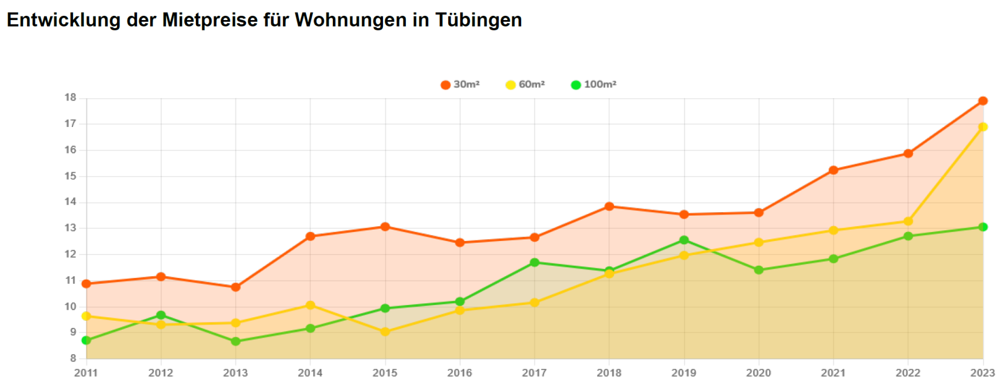

## Datenextraktion aus Bildern

Manchmal sind Daten nur in Form von Bildern verfügbar, z.B. in Diagrammen oder Tabellen, die nicht als Text vorliegen. 
Zum Beispiel haben wir das folgende Liniendiagramm aus einem PDF-Dokument extrahiert und als Bild gespeichert.

{alt='Diagramm Mietpreise Tübingen'}

Die Datei [`mietpreise-tuebingen.png`](https://raw.githubusercontent.com/Dr-Eberle-Zentrum/FDM-basics/main/instructors/fig/mietpreise-tuebingen.png) enthält die Mietpreise für Tübingen in den Jahren 2011 bis 2023 für drei Kategorien von Wohnungsgrößen (bis 30, 60 oder 100 m²).

Ziel der Aufgabe ist es, die Daten aus dem Diagramm zu extrahieren und in einer CSV-Datei zu speichern.


### Aufgabe 1 - Datenextraktion

Zur Extraktion der Daten verwenden wir das frei verfügbare Version 4 des Onlinetools [WebPlotDigitizer](https://apps.automeris.io/wpd4/).

- Öffnen Sie das Tool und laden Sie das Diagrammbild `mietpreise-tuebingen.png` hoch.
  - links oben "File" -> "Load Image(s)"
  - "2D (X-Y) Plot" -> "Align Axes"
- Nun müssen sie die Achsen des Diagramms kalibrieren, damit die Bildpositionen in reale Werte umgerechnet werden können.
  - Beachten sie die Vergrößerung des Mauszeigerbereichs rechts oben.
  - Tragen sie entsprechende Werte für die ausgewählten Bildpunkte ein.
- Benennen sie den **Datensatz in "30qm"** um und setzen sie die Datensatzfarbe auf dunkelrot (linkes Menü).
- Verwenden sie im rechten Menü "Add Point" und klicken sie auf die Mitte aller roten-orangenen Linienpunkte, um entsprechende Datenpunkte zu erstellen (sollten am Ende 13 Stück sein, siehe links unter dem Menü)
- Um den nächsten Datensatz zu erstellen, klicken sie links auf "Datasets" -> "Add Dataset" und erstellen sie Datensätze für "60qm" (dunkelgelb) und "100qm" (dunkelgrün).
  - Achten sie darauf die Namen und Farben anzupassen!
- Als nächstes wollen wir für den **Datensatz "100qm"** die automatische Detektion der Bildwerte austesten. 
  - Datensatz auswählen (links oben)
  - rechts im Menü auf das Farbfelder der "Foreground Color" klicken, dann auf "Color Picker" und im Bild auf einen Punkt der grünen Linie klicken. "Done"
  - rechts den "Algorithm" auf "X Step" setzen, da wir ja nur an Werten den Jahresmarken interessiert sind, und die Achsengrenzen entsprechend einstellen.
  - "Run" sollte nun die Werte der grünen Linie automatisch erkennen.
- Versuchen sie nun die Werte des **"60qm" Datensatzes** zu bestimmen.
  - links Datensatz auswählen!
  - können die Punkte automatisch erkannt werden, oder müssen sie manuell gesetzt werden?
- Wenn alle der Datensätze erfasst sind, können sie die Daten exportieren.
  - links auf "Datasets" -> "Export All Data" -> "Download .CSV"
  - **Dateiname:** `mietpreise-tuebingen.csv`
  
Prüfen sie den Inhalt der Datei! Sie sollte ungefähr so aussehen und 15 Zeilen haben:

```csv
30qm,,60qm,,100qm,
X,Y,X,Y,X,Y
2010.993894993895,10.893854748603355,2010.993894993895,9.664804469273744,2011,8.714344396976669
2012,11.173184357541901,2012,9.301675977653634,2012,9.68230364771607
2012.996336996337,10.75418994413408,2012.986568986569,9.385474860335199,2013,8.669323036477163
2014.002442002442,12.681564245810058,2013.992673992674,10.055865921787712,2014,9.187068682221494
2015.018315018315,13.04469273743017,2014.998778998779,8.99441340782123,2015,9.952431810713113
2015.965811965812,12.430167597765365,2015.995115995116,9.888268156424584,2016,10.211304633585279
2017.001221001221,12.681564245810058,2017.001221001221,10.16759776536313,2017,11.70826487019389
2018.0073260073261,13.798882681564248,2017.997557997558,11.229050279329611,2018,11.49441340782123
2018.984126984127,13.5195530726257,2019.003663003663,11.983240223463689,2019,12.563670719684524
2020.019536019536,13.603351955307264,2019.9902319902321,12.45810055865922,2020,11.415626026947093
2020.996336996337,15.22346368715084,2021.0061050061051,12.905027932960895,2021,11.84332895169241
2021.992673992674,15.8659217877095,2022.002442002442,13.296089385474861,2022,12.70999014130792
2023.018315018315,17.932960893854748,2022.998778998779,16.899441340782126,2023,13.0589056851791
```

### Aufgabe 2 - Dokumentation

Erstellen sie eine TEXT-Datei `mietpreise-tuebingen.README.txt` und dokumentieren sie darin die Schritte, die sie zur Extraktion der Daten durchgeführt haben.

Dokumentieren sie auch das verwendete Tool, dessen Version, Zugriffszeit und welche Datensätze sie manuell oder automatisch (mit welcher Funktionalität + Einstellung) erstellt haben.

Listen sie auch ihre eigenen Autoreninformationen (ihren Namen bzw. alle Namen aus ihrem Team) und das Bearbeitungsdatum.


